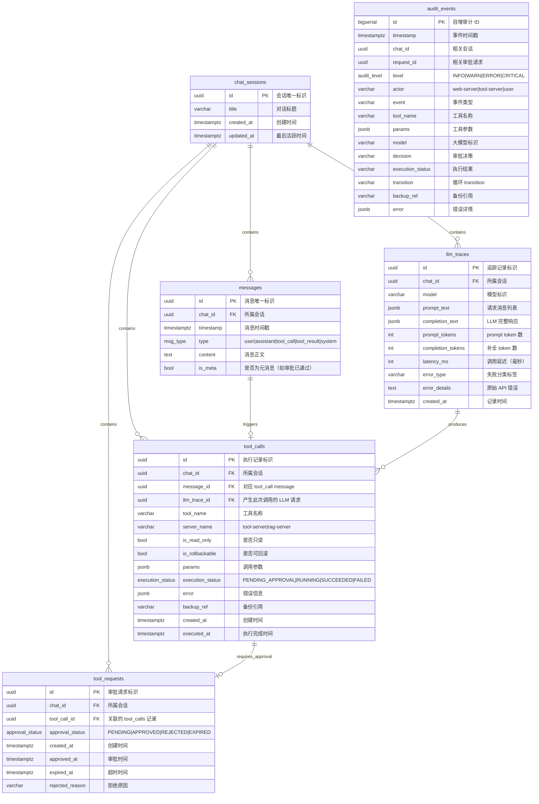

# 数据库设计

web-server 使用 PostgreSQL 作为持久化存储。所有会话、消息、工具调用、审批请求、审计事件和 LLM 追踪统一写入数据库。

## 设计原则

- **Schema 隔离**：web-server 独占一个 PostgreSQL schema，不与 tool-server/rag-server 共享表空间
- **审计不可变**：audit_events 表仅 INSERT 和 SELECT，禁止 UPDATE/DELETE
- **JSONB 用于半结构化字段**：工具参数(params)、执行错误(error) 等字段使用 JSONB，避免 EAV 或宽表
- **索引最小化**：只在查询路径上建索引，不为"未来可能需要"的字段预建

## ER 图



## 表定义

### chat_sessions

| 列 | 类型 | 约束 | 说明 |
|----|------|------|------|
| `id` | `UUID` | PK | 会话唯一标识 |
| `title` | `VARCHAR(128)` | nullable | 对话标题，由首条用户消息自动生成或用户手动设置 |
| `created_at` | `TIMESTAMPTZ` | NOT NULL, DEFAULT NOW() | 创建时间 |
| `updated_at` | `TIMESTAMPTZ` | NOT NULL, DEFAULT NOW() | 最后活跃时间，消息写入时更新 |

### messages

| 列 | 类型 | 约束 | 说明 |
|----|------|------|------|
| `id` | `UUID` | PK | 消息唯一标识 |
| `chat_id` | `UUID` | FK → chat_sessions, NOT NULL | 所属会话 |
| `timestamp` | `TIMESTAMPTZ` | NOT NULL | 消息时间戳 |
| `type` | `msg_type` | NOT NULL | user / assistant / tool_call / tool_result / system |
| `content` | `TEXT` | NOT NULL | 消息正文 |
| `is_meta` | `BOOLEAN` | NOT NULL, DEFAULT false | 是否为元消息 |

`msg_type` 枚举：
```sql
CREATE TYPE msg_type AS ENUM ('user', 'assistant', 'tool_call', 'tool_result', 'system');
```

索引：
- `messages(chat_id, timestamp)` — 按会话加载历史消息
- `messages(chat_id, type)` — 过滤特定类型消息（如仅加载 tool_call）

### tool_calls

| 列 | 类型 | 约束 | 说明 |
|----|------|------|------|
| `id` | `UUID` | PK | 执行记录标识 |
| `chat_id` | `UUID` | FK → chat_sessions, NOT NULL | 所属会话 |
| `message_id` | `UUID` | FK → messages, NOT NULL | 对应的 tool_call 消息 |
| `llm_trace_id` | `UUID` | FK → llm_traces, NOT NULL | 产生此次工具调用的 LLM 请求 |
| `tool_name` | `VARCHAR(128)` | NOT NULL | 工具名称 |
| `server_name` | `VARCHAR(32)` | NOT NULL | tool-server / rag-server |
| `is_read_only` | `BOOLEAN` | NOT NULL | 是否只读（来源：tool-server 工具注册信息） |
| `is_rollbackable` | `BOOLEAN` | NOT NULL | 是否可回滚（来源：tool-server 工具注册信息） |
| `params` | `JSONB` | NOT NULL | 调用参数 |
| `execution_status` | `execution_status` | NOT NULL | PENDING_APPROVAL / RUNNING / SUCCEEDED / FAILED |
| `error` | `JSONB` | nullable | 执行失败时的错误信息 |
| `backup_ref` | `VARCHAR(256)` | nullable | 可回滚操作的备份引用 |
| `created_at` | `TIMESTAMPTZ` | NOT NULL, DEFAULT NOW() | 创建时间 |
| `executed_at` | `TIMESTAMPTZ` | nullable | 执行完成时间 |

枚举：
```sql
CREATE TYPE execution_status AS ENUM ('PENDING_APPROVAL', 'RUNNING', 'SUCCEEDED', 'FAILED');
```

索引：
- `tool_calls(chat_id, created_at)` — 按会话查询执行历史
- `tool_calls(llm_trace_id)` — 按 LLM 调用追溯产生的工具调用

### tool_requests

审批记录。仅高风险工具创建，通过 `tool_call_id` 引用 `tool_calls` 获取工具元数据（name、params、server 等），本表只存审批决策相关字段。

| 列 | 类型 | 约束 | 说明 |
|----|------|------|------|
| `id` | `UUID` | PK | request_id，审批请求唯一标识 |
| `chat_id` | `UUID` | FK → chat_sessions, NOT NULL | 所属会话 |
| `tool_call_id` | `UUID` | FK → tool_calls, NOT NULL, UNIQUE | 关联的工具调用记录 |
| `approval_status` | `approval_status` | NOT NULL, DEFAULT PENDING | PENDING / APPROVED / REJECTED / EXPIRED |
| `created_at` | `TIMESTAMPTZ` | NOT NULL, DEFAULT NOW() | 创建时间 |
| `approved_at` | `TIMESTAMPTZ` | nullable | 审批时间 |
| `expired_at` | `TIMESTAMPTZ` | nullable | 超时时间（created_at + 5 分钟） |
| `rejected_reason` | `TEXT` | nullable | 用户填写的拒绝原因 |

枚举：
```sql
CREATE TYPE approval_status AS ENUM ('PENDING', 'APPROVED', 'REJECTED', 'EXPIRED');
```

索引：
- `tool_requests(chat_id, created_at)` — 按会话查询审批历史
- `tool_requests(approval_status)` — 查询待审批/已过期请求
- `tool_requests(expired_at)` — 超时扫描（`WHERE approval_status = 'PENDING' AND expired_at < NOW()`）
- `tool_requests(tool_call_id)` — UNIQUE 约束自带索引，按工具调用反查审批

### audit_events

| 列 | 类型 | 约束 | 说明 |
|----|------|------|------|
| `id` | `BIGSERIAL` | PK | 自增审计 ID，确保插入有序 |
| `timestamp` | `TIMESTAMPTZ` | NOT NULL | 事件时间戳 |
| `chat_id` | `UUID` | nullable | 相关会话 |
| `request_id` | `UUID` | nullable | 相关审批请求 |
| `level` | `audit_level` | NOT NULL | INFO / WARN / ERROR / CRITICAL |
| `actor` | `VARCHAR(32)` | NOT NULL | web-server / tool-server / user |
| `event` | `VARCHAR(64)` | NOT NULL | 事件类型 |
| `tool_name` | `VARCHAR(128)` | nullable | 工具名称 |
| `params` | `JSONB` | nullable | 工具参数 |
| `model` | `VARCHAR(64)` | nullable | 大模型标识 |
| `decision` | `VARCHAR(16)` | nullable | APPROVED / REJECTED / AUTO_APPROVED |
| `execution_status` | `VARCHAR(16)` | nullable | SUCCEEDED / FAILED / SKIPPED |
| `transition` | `VARCHAR(32)` | nullable | Agent 循环 transition 值（event=LOOP_TRANSITION 时填写） |
| `backup_ref` | `VARCHAR(256)` | nullable | 备份引用 |
| `error` | `JSONB` | nullable | 错误详情 |

枚举：
```sql
CREATE TYPE audit_level AS ENUM ('INFO', 'WARN', 'ERROR', 'CRITICAL');
```

索引：
- `audit_events(timestamp)` — 按时间范围查询
- `audit_events(chat_id)` — 按会话追溯审计链
- `audit_events(level)` — 按严重等级过滤
- `audit_events(request_id)` — 按审批请求反查审计事件

### llm_traces

| 列 | 类型 | 约束 | 说明 |
|----|------|------|------|
| `id` | `UUID` | PK | 追踪记录标识 |
| `chat_id` | `UUID` | FK → chat_sessions, NOT NULL | 所属会话 |
| `model` | `VARCHAR(64)` | NOT NULL | 模型标识 |
| `prompt_text` | `JSONB` | NOT NULL | 请求消息列表（messages array） |
| `completion_text` | `JSONB` | nullable | LLM 返回的完整响应 |
| `prompt_tokens` | `INTEGER` | NOT NULL | prompt 消耗 token 数 |
| `completion_tokens` | `INTEGER` | NOT NULL | 补全消耗 token 数 |
| `latency_ms` | `INTEGER` | NOT NULL | 调用延迟（毫秒） |
| `error_type` | `VARCHAR(32)` | nullable | 调用失败时的分类标签：`prompt_too_long` / `max_output_tokens` / `rate_limit` / `auth_failed` / `model_unavailable` / `timeout` / `server_error` / `unknown`；调用成功为 null |
| `error_details` | `TEXT` | nullable | 原始 API 错误信息，供恢复逻辑解析 |
| `created_at` | `TIMESTAMPTZ` | NOT NULL, DEFAULT NOW() | 记录时间 |

索引：
- `llm_traces(chat_id, created_at)` — 按会话查询追踪历史
- `llm_traces(model, created_at)` — 按模型统计成本
- `llm_traces(error_type)` — 按错误类型分析失败率

## 写入策略

### 一次 LLM 调用的完整写入流程

```
LLM 调用开始
  ↓
LLM 调用完成 → INSERT llm_traces（含 error_type、latency_ms 等）
  ↓
LLM 响应解析
  ├─ 文本回复 → INSERT messages (type=assistant)
  │
  └─ tool_call → INSERT messages (type=tool_call)
                   INSERT tool_calls (execution_status=PENDING_APPROVAL)
                   ↓
                 审查层判定
                   ├─ 只读 / 白名单 → UPDATE tool_calls (execution_status=RUNNING)
                   │                    ↓ MCP 调用
                   │                    ├─ 成功 → UPDATE tool_calls (execution_status=SUCCEEDED)
                   │                    │         INSERT messages (type=tool_result)
                   │                    └─ 失败 → UPDATE tool_calls (execution_status=FAILED, error)
                   │                              INSERT messages (type=tool_result, 含错误)
                   │
                   └─ 高风险 → INSERT tool_requests (tool_call_id=tool_calls.id, approval_status=PENDING)
                                ↓ 等待审批
                                ├─ APPROVED → UPDATE tool_requests (approval_status=APPROVED, approved_at)
                                │              UPDATE tool_calls (execution_status=RUNNING)
                                │              ↓ MCP 调用（同上）
                                │
                                ├─ REJECTED → UPDATE tool_requests (approval_status=REJECTED, ...)
                                │              UPDATE tool_calls (execution_status=FAILED)
                                │
                                └─ 超时 → UPDATE tool_requests (approval_status=EXPIRED)
                                           UPDATE tool_calls (execution_status=FAILED)
```

### 各表写入规则

| 实体 | 写入时机 | 策略 |
|------|----------|------|
| chat_sessions | 创建会话 / 每次消息写入 | `INSERT ON CONFLICT DO UPDATE updated_at` |
| messages | 每产生一条消息 | `INSERT` 追加 |
| llm_traces | 每次 LLM 调用完成（成功或失败） | `INSERT`，含 error_type 和 error_details |
| tool_calls | LLM 产出 tool_call 时 | `INSERT`，所有工具统一 PENDING_APPROVAL；审查后 UPDATE 为 RUNNING；执行完成后 UPDATE 状态、结果、executed_at；启动时扫描 RUNNING 记录恢复 |
| tool_requests | 高风险 tool_call 进入审查层 | `INSERT`，通过 tool_call_id 引用 tool_calls；仅存审批决策字段 |
| audit_events | 每个审计事件发生 | `INSERT` 仅追加，禁止 UPDATE/DELETE |

### RUNNING 状态恢复

`execute_tool` MCP 调用发送后、结果写回前，若 web-server 崩溃，tool_calls 记录将停留在 `RUNNING`。恢复流程：

```
web-server 启动
  → SELECT * FROM tool_calls WHERE execution_status = 'RUNNING'
  → 逐条向 tool-server 重发 execute_tool（相同 request_id）
  → tool-server 按 request_id 去重：缓存命中则返回原结果，未命中则重新执行
  → UPDATE tool_calls, INSERT messages
```

后台兜底任务每 60 秒将 `created_at` 超过 5 分钟的 `RUNNING` 记录标记为 `FAILED`（error: `crash_recovery_timeout`）。详见 `doc/详细设计.md` 的服务崩溃恢复章节。

## 审计日志格式

每条审计事件写入 `audit_events` 表，示例记录：

```json
{
  "timestamp": "2026-05-07T12:00:00Z",
  "chat_id": "<chat-uuid>",
  "request_id": "<request-uuid>",
  "level": "INFO | WARN | ERROR | CRITICAL",
  "actor": "web-server | tool-server | user",
  "event": "AUTO_APPROVED | TOOL_REQUEST_CREATED | APPROVED | REJECTED | EXPIRED | MCP_CONNECTION_TIMEOUT | SECURITY_VIOLATION | TOOL_EXECUTED | TOOL_EXECUTION_FAILED | MCP_CONNECTION_FAILED | LLM_CALL_FAILED | LLM_RATE_LIMITED | LLM_PROMPT_TOO_LONG | LLM_AUTH_FAILED | LLM_MODEL_UNAVAILABLE | LLM_TIMEOUT | LOOP_TRANSITION",
  "tool_name": "delete_temp_files",
  "params": { "path": "/tmp" },
  "model": "<model-id>",
  "decision": "APPROVED",
  "execution_status": "SUCCEEDED | FAILED | SKIPPED",
  "transition": "done | error_exit | ...（event=LOOP_TRANSITION 时填写）",
  "backup_ref": "<optional>",
  "error": "<optional>"
}
```

`audit_events` 表仅支持 INSERT 和 SELECT，禁止 UPDATE/DELETE。审计日志由 web-server 统一写入，tool-server 不直接写审计日志。
