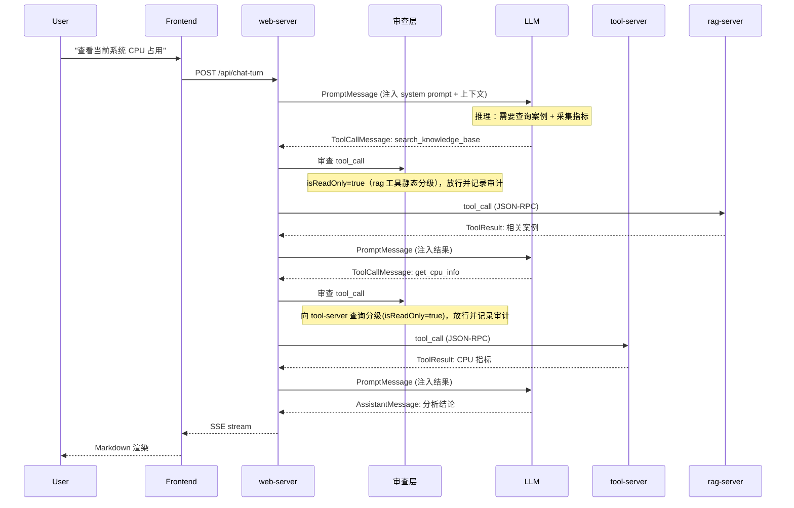
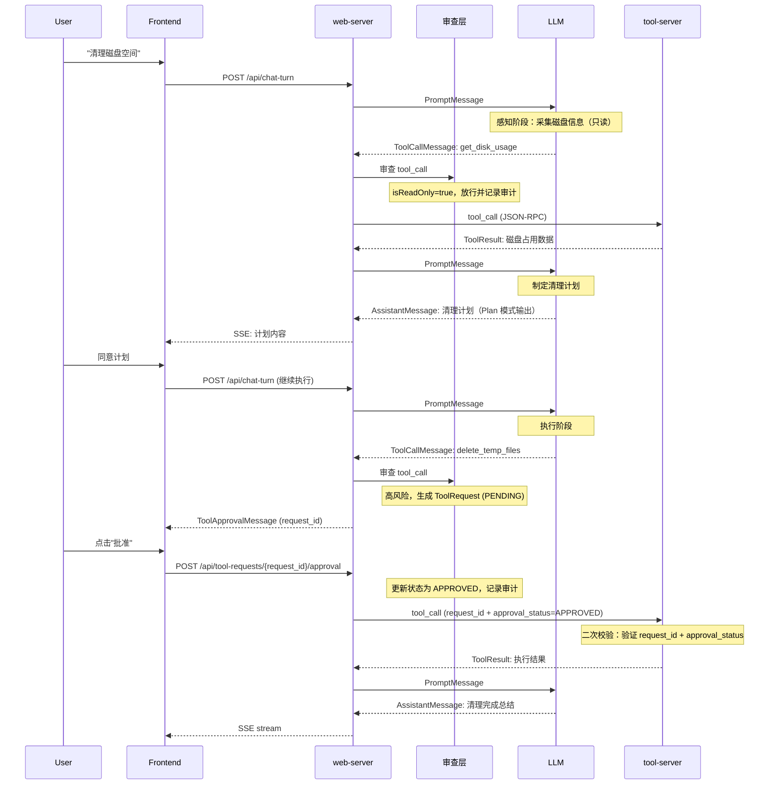
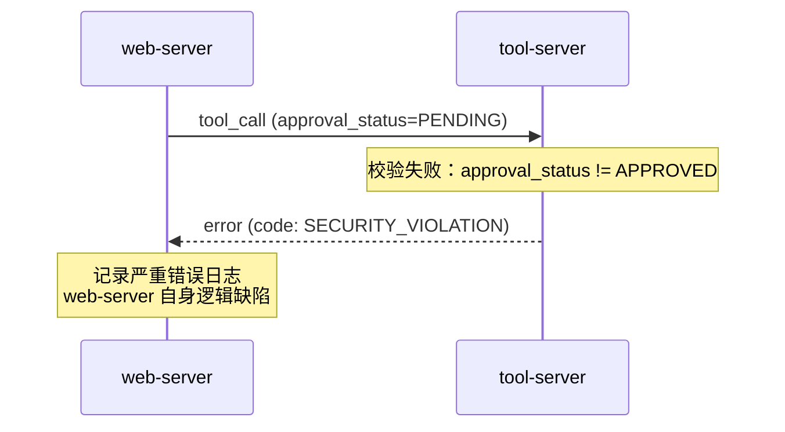

# 详细设计

## 文档目标

定义项目中各服务共享的模块边界、数据结构、状态机、接口契约和跨服务流程。

## 文档边界

- 只写所有服务都必须遵守的规范：数据结构、状态机、协议、错误处理、审查规则、审计要求
- 不写单个服务的内部实现细节：Agent 节点拓扑、SSE 组包策略、Prompt 组装过程、具体工具执行逻辑
- 服务内部行为、流程图和实现说明分别放在各自 `README.md`、`graph.md` 中

## 完整交互时序

> 说明：以下时序图用于帮助理解跨服务协作关系，不作为单个服务的内部实现说明。

### 场景一：只读诊断（含 RAG 检索）



### 场景二：高风险操作（含审批）



### 场景三：安全违规路径



## 命名规范

所有数据结构字段、Python 变量、数据库列名统一使用 **snake_case**（PEP 8）。

JSON 序列化直接使用字段名，不做别名转换。

## 基础数据结构

所有数据结构以 web-server 为核心定义。

### Message

```
Message {
  message_id: string (UUID)
  session_id: string (UUID)
  timestamp: string (RFC 3339)
  type: string [user | assistant | tool_call | tool_result | system]
  content: string
  is_meta: boolean  // 是否为对话状态的描述性消息（如"审批已通过"）
}
```

| 字段 | 说明 |
|------|------|
| `type: user` | 用户输入 |
| `type: assistant` | LLM 文本回复 |
| `type: tool_call` | LLM 请求调用工具（包含 tool_name 和 params） |
| `type: tool_result` | 工具执行结果（关联 tool_call 的 message_id） |
| `type: system` | 系统通知（连接状态、错误提示等） |
| `is_meta: true` | 该消息是对对话状态的描述而非对话内容本身 |

### Tool

```
Tool {
  name: string              // 工具唯一名称
  server: string            // 所属 MCP Server (tool-server | rag-server)
  description: string       // LLM 可见的工具描述
  is_read_only: boolean     // 由 tool-server 根据参数动态判定，true = 只读
  is_rollbackable: boolean  // 由 tool-server 根据参数动态判定，true = 可回滚
  params_schema: object     // JSON Schema，定义工具参数
}
```

`is_read_only` 和 `is_rollbackable` 不是静态属性，而是 tool-server 根据每次调用的实际参数内容动态返回的分级结果。例如 Bash 的 `ls /tmp` 返回 `is_read_only=true`，`rm -rf /var/lib/mysql` 返回 `is_read_only=false, is_rollbackable=false`。

### ToolCall : Tool

```
ToolCall {
  // 继承 Tool 的属性
  session_id: string (UUID)
  message_id: string (UUID)
  params: object
  request_id: string (UUID, optional)   // 仅高风险操作需要
  approval_status: string [PENDING | APPROVED | REJECTED | EXPIRED]
  execution_status: string [PENDING_APPROVAL | RUNNING | SUCCEEDED | FAILED]
  error: object (optional)  // 执行失败时的错误信息
  timestamp: string (RFC 3339)
}
```

### ToolRequest : Tool

```
ToolRequest {
  // 继承 Tool 的属性
  session_id: string (UUID)
  message_id: string (UUID)
  request_id: string (UUID)
  params: object
  approval_status: string [PENDING | APPROVED | REJECTED | EXPIRED]
  created_at: string (RFC 3339)
  approved_at: string (RFC 3339, optional)
  expired_at: string (RFC 3339, optional)
}
```

### ChatSession

```
ChatSession {
  id: string (UUID)
  title: string         // 对话标题，由首条用户消息自动生成或用户手动设置
  messages: Message[]
  executed_tool_list: ToolCall[]
  transition: string    // 当前循环状态变更原因，写入 audit_events 表供追溯
  turn_count: int       // 当前已执行轮次
  max_turns: int        // 最大轮次上限
  timestamp: string (RFC 3339)
}
```

`transition` 取值见 `web-server/README.md` 的 Transition 追踪表。

## System Prompt 结构

System prompt 由多个命名 section 按固定顺序组装为单一 prompt 注入 LLM。每个 section 独立维护，可单独覆盖。

> 说明：这里只定义 prompt 的结构契约，不定义 `PromptManager` 的具体缓存或拼装算法，算法细节见 `web-server/README.md`。

| Section | 类别 | 职责 |
|---------|------|------|
| `identity` | 静态 | Agent 角色身份与核心能力描述 |
| `rules` | 静态 | 强制遵守的行为规则|
| `tool_usage` | 静态 | 工具调用规范：并行策略、结果验证、错误处理 |
| `environment` | 动态 | 目标系统基础信息（hostname、OS 版本、挂载范围、系统时间） |
| `memory` | 动态 | 持久记忆内容 |

### 静态 vs 动态

- **静态 section**：内容不随会话或轮次变化，首次加载后缓存。仅在配置重载或显式清理时重建
- **动态 section**：每次 chat-turn 重新构建

### 组装顺序

`identity → rules → tool_usage → environment → memory`

### 覆盖机制

`prompt.md` 可按 section 名覆盖默认内容。未覆盖的 section 使用内置默认值。默认值定义见 `web-server/README.md`。

`PromptManager` 负责 section 的加载、缓存、覆盖合并和组装。组装结果为一个字符串，作为 system message 注入 LLM 请求。实现细节见 `web-server/README.md`。

## 操作分级规则

分级由 tool-server 根据工具参数内容动态判定，web-server 不直接判断参数风险。

| 分级 | 条件 | 行为 |
|------|------|------|
| 只读 | `isReadOnly = true` | 自动审批通过 |
| 可回滚 | `isReadOnly = false ∧ isRollbackable = true` | 需用户确认后审批通过 |
| 破坏性 | `isReadOnly = false ∧ isRollbackable = false` | 需用户确认后审批通过 |

## MCP 通信协议

web-server 与 tool-server、rag-server 之间使用 JSON-RPC 2.0，通过 fastmcp 实现。

> 说明：这里只定义跨服务调用契约，不展开具体客户端连接池、重试、超时和发现流程。

### classify_tool（分级查询）

web-server 在审查层调用此方法，向 tool-server 查询工具参数的操作分级。

```json
{
  "jsonrpc": "2.0",
  "method": "classify_tool",
  "params": {
    "tool_name": "bash",
    "params": { "command": "rm -rf /var/lib/mysql" }
  },
  "id": 1
}
```

成功响应：

```json
{
  "jsonrpc": "2.0",
  "result": {
    "isReadOnly": false,
    "isRollbackable": false
  },
  "id": 1
}
```

### execute_tool（执行工具）

审批通过后执行工具。

```json
{
  "jsonrpc": "2.0",
  "method": "execute_tool",
  "params": {
    "tool_name": "delete_temp_files",
    "chat_id": "<chat-uuid>",
    "message_id": "<message-uuid>",
    "params": { "path": "/tmp" },
    "request_id": "<request-uuid>",
    "approval_status": "APPROVED"
  },
  "id": 1
}
```

所有请求必须包含 `id`，不支持 Notification（无 id 的请求）。

### 成功响应

```json
{
  "jsonrpc": "2.0",
  "result": {
    "execution_status": "SUCCEEDED",
    "backup_ref": "<optional>",
    "output": { ... }
  },
  "id": 1
}
```

### 错误响应

```json
{
  "jsonrpc": "2.0",
  "error": {
    "code": 403,
    "message": "SECURITY_VIOLATION",
    "data": "request_id invalid or approval_status != APPROVED"
  },
  "id": 1
}
```

## 审查与执行流程

**所有** tool_call 统一进入审查层，不可绕过。审查流程：

1. 向 tool-server 查询分级（`classify_tool`）
2. 结合 `rules.json` 规则匹配：黑名单拒绝 / 白名单放行 / 默认按分级处理
3. 只读 → 放行并记录审计；高风险 → 生成 ToolRequest（PENDING），推送前端等用户确认
4. 用户批准后调用 tool-server 执行，tool-server 执行前做安全校验（验证 `approval_status == APPROVED`）

审批超时 5 分钟自动拒绝。详见 `web-server/graph.md`。

### ToolRequest / ToolCall 状态机

```
ToolRequest (审批)              ToolCall (执行)
===============                ==============
PENDING ──批准──▶ APPROVED ──调用 tool-server──▶ RUNNING ──成功──▶ SUCCEEDED
   │                  │                              │
   │                  │                              ├──失败──▶ FAILED
   │                  │                              └──校验失败──▶ SECURITY_VIOLATION
   │                  └──拒绝──▶ REJECTED
   └──超时──▶ EXPIRED
```

ToolRequest 仅管理审批状态；ToolCall 审批通过后进入 RUNNING 执行。

### 终态处理

| 终态 | 行为 |
|------|------|
| REJECTED | LLM 告知用户被拒原因，等待新指示。不自动重试 |
| FAILED | LLM 分析错误：可修复则修正后重试，不可修复则告知用户 |
| EXPIRED | LLM 告知审批超时失效，需重新输入指令 |

## 错误处理

### JSON-RPC 调用层

web-server 与 tool-server / rag-server 之间的 MCP 调用错误按统一策略处理：

| 场景 | 策略 |
|------|------|
| 连接超时（无法建立连接） | 最多重试 2 次，间隔 1s / 2s 指数退避，仍失败则向 LLM 反馈 "tool unavailable"，由 LLM 决定替代方案 |
| 调用超时（已连接但执行无响应） | 不重试。统一标记 `execution_status=FAILED`，记录审计日志，将超时结果反馈给 LLM |
| 工具返回业务错误（非安全违规） | 不重试。将错误结构化后反馈给 LLM，由 LLM 决定是否换参数重试或换方案 |
| SECURITY_VIOLATION | 不重试。记录 CRITICAL 日志，通知前端 |

原则：传输层仅做最基本的连接重试，业务级重试决策权在 Agent 层（LLM）。

### 服务崩溃恢复

web-server 在 `execute_tool` 已发送但结果未写回时崩溃，会导致 `tool_calls` 状态永久停留在 `RUNNING`，而工具副作用已在系统上发生。

**恢复机制：启动扫描 + request_id 幂等**

web-server 启动时：

```
SELECT * FROM tool_calls WHERE execution_status = 'RUNNING'
FOR EACH:
  向 tool-server 重新发送 execute_tool（相同 request_id）
  ├─ 缓存命中 → 获取原始结果 → UPDATE tool_calls, INSERT messages
  └─ 缓存未命中 → 重新执行 → UPDATE tool_calls, INSERT messages
```

tool-server 侧：以 `request_id` 为键在内存中缓存执行结果（TTL 10 分钟），收到重复 `request_id` 时直接返回缓存结果，不重复执行。

**超时兜底**：后台任务每 60 秒将 `created_at` 超过 5 分钟的 `RUNNING` 记录标记为 `FAILED`（error: `crash_recovery_timeout`），防止永久僵死。

**覆盖场景：**

| 故障类型 | tool-server 缓存 | 恢复方式 |
|---------|:---:|---------|
| web-server 单独崩溃重启 | 命中 | 缓存直接返回结果 |
| 网络瞬时中断后重试 | 命中 | 缓存直接返回结果 |
| 两台同时断电重启 | 未命中 | 重新执行（依赖工具幂等性） |
| 长期无人处理的 RUNNING 记录 | — | 5 分钟超时标记 FAILED |

### 审计日志等级

所有工具调用统一写入审计日志。等级由工具原本的危险属性决定，不由审批路径决定：

| 等级 | 触发场景 |
|------|----------|
| INFO | 只读工具执行（原本安全） |
| WARN | 高风险工具执行（用户确认或白名单覆盖）；黑名单触发；审批拒绝/超时；工具超时；连接重试 |
| ERROR | 工具执行失败 |
| CRITICAL | SECURITY_VIOLATION（tool-server 收到非 APPROVED 请求） |


### LLM 错误分类

LLM Adapter 层将各类异常映射为标准化分类，供上层恢复逻辑和审计日志使用：

| 分类标签 | 触发条件 | 可否恢复 |
|----------|----------|----------|
| `prompt_too_long` | API 返回 413 / 400，提示词超限 | 是：压缩后重试 |
| `max_output_tokens` | API 返回响应截断信号（stop_reason=max_tokens） | 是：提升上限重试或注入 continue |
| `rate_limit` | API 返回 429 | 否：转达用户 |
| `auth_failed` | API 返回 401 / 403 | 否：配置问题 |
| `model_unavailable` | 模型不存在或无访问权限 | 是：切换 fallback model |
| `timeout` | 连接超时或无响应 | 否：转达用户 |
| `server_error` | API 返回 5xx（含 529 Overloaded） | 是：fallback model |
| `unknown` | 其他异常 | 否 |

无论成功或失败，每次 LLM 调用都写入 `llm_traces` 表，`error_type` 和 `error_details` 仅在失败时有值，供审计和监控分析。

### LLM 响应错误恢复链

LLM 调用返回可恢复错误时，逐层升级，对用户透明。详细流程见 `web-server/graph.md`。

| 错误类型 | 第1层 | 第2层 | 终态 | 防重入 guard |
|----------|-------|-------|------|-------------|
| prompt_too_long | 上下文压缩后重试 | 紧急压缩后重试 | 终止并展示错误 | 第1层：`has_compacted_this_turn`；第2层：`has_attempted_aggressive_compact` |
| max_output_tokens | 提升上限透明重试 | 注入 "continue" 消息, 最多 3 次 | 终止并展示错误 | 第1层：`max_tokens_escalated`；第2层：`output_token_recovery_count` |
| model_unavailable / server_error | 切换 fallback model 重试 | — | 终止并展示错误 | 第1层：`fallback_attempted` |

## 可观测性

| 系统 | 存储 | 内容 | 详见 |
|------|------|------|------|
| 审计日志 | PostgreSQL `audit_events` | 安全事件：审查决策、执行结果、transition；LLM 错误事件（恢复失败或不可恢复时写入） | `doc/数据库设计.md` |
| LLM 追踪 | PostgreSQL `llm_traces` | 每次 LLM 调用的 model、token、延迟、error_type（调用完成时立即写入） | `doc/数据库设计.md` |
| 成本追踪 | PostgreSQL（聚合查询）| 按模型累计 token 和费用，跨会话持久化 | `web-server/README.md` |
| 应用日志 | `servers.log` | 启动/关闭/错误/警告 | — |
| 调试日志 | `logs/debug/` | Agent 决策叙事，分级过滤，环境变量门控 | `web-server/README.md` |
| 检查点剖析器 | `logs/debug/` | Agent 循环各阶段耗时，环境变量门控 | `web-server/README.md` |
| 错误日志 | 内存环形缓冲 + 文件 | 运行时错误，MCP 通信错误独立存储 | `web-server/README.md` |

## 子项目文档

各服务实现细节见对应目录：
- `web-server/README.md` — Agent 循环、审查层、SSE 事件、可观测性
- `web-server/graph.md` — 内部流程图
- `tool-server/README.md` — 工具列表、安全校验逻辑
- `rag-server/README.md` — 知识检索/写入/质量控制
- `frontend/README.md` — 组件结构

数据库 Schema 见 `doc/数据库设计.md`，REST 契约见 `doc/api-spec/openapi.yaml`。
