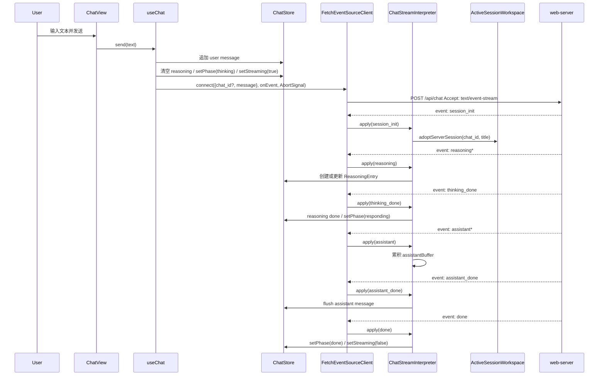
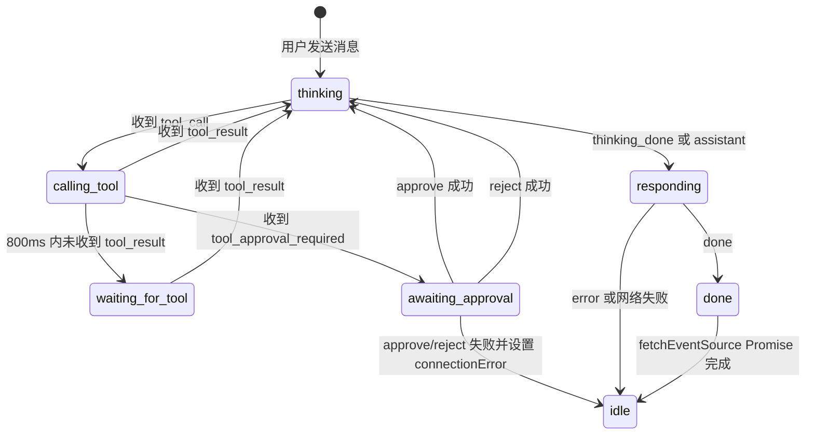
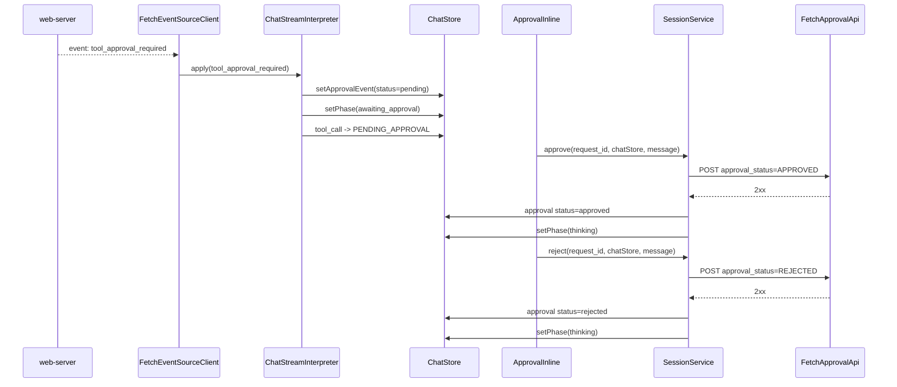
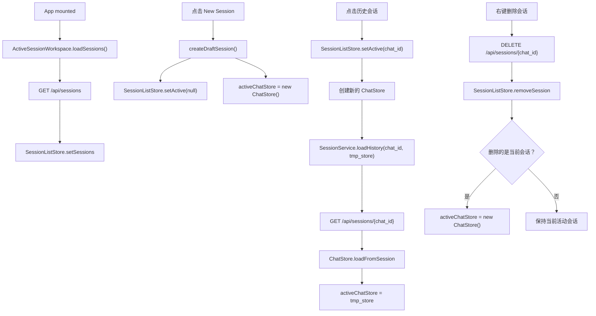
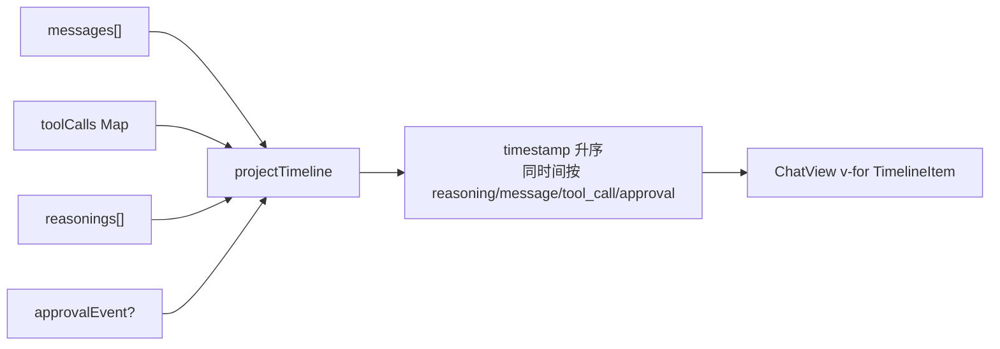

# frontend 流程图

本文档描述前端子项目当前代码中的模块依赖、聊天流、会话流和审批流。

## 模块依赖图

```mermaid
flowchart TD
    app["App.vue<br/>依赖装配 / provide"]

    subgraph presentation["presentation + components"]
        session_list["SessionList.vue<br/>会话列表 / 分组 / 右键删除"]
        chat_view["ChatView.vue<br/>时间线 / 输入 / 错误横幅"]
        message_item["MessageItem.vue<br/>消息渲染"]
        tool_inline["ToolCallInline.vue<br/>工具调用渲染"]
        approval_inline["ApprovalInline.vue<br/>审批渲染"]
        reasoning_bubble["ReasoningBubble.vue<br/>思考过程渲染"]
        toast_container["ToastContainer.vue<br/>toast 渲染"]
        use_chat["useChat<br/>聊天 SSE 生命周期"]
        use_sessions["useSessionList<br/>会话列表状态"]
        use_timeline["useTimeline<br/>时间线计算"]
        use_scroll["useAutoScroll<br/>自动滚动"]
        use_toast["useToast<br/>toast 状态"]
    end

    subgraph application["application"]
        chat_store["ChatStore<br/>活动会话状态"]
        session_list_store["SessionListStore<br/>会话列表状态"]
        session_service["SessionService<br/>会话/审批用例"]
        workspace["ActiveSessionWorkspace<br/>活动 ChatStore 管理"]
        interpreter["ChatStreamInterpreter<br/>SSE 事件解释"]
        projection["projectTimeline<br/>统一时间线投影"]
        toast_store["ToastStore<br/>toast 队列"]
        ports["ports.ts<br/>SseClient / SessionApi / ApprovalApi"]
    end

    subgraph infrastructure["infrastructure"]
        sse_client["FetchEventSourceClient<br/>POST /api/chat SSE"]
        session_api["FetchSessionApi<br/>/api/sessions"]
        approval_api["FetchApprovalApi<br/>/api/tool-requests/*/approval"]
        markdown["renderMarkdown<br/>marked + DOMPurify + highlight.js"]
    end

    subgraph domain["domain"]
        models["models.ts<br/>Message / ChatSession / ToolCallInfo"]
        sse_events["sse-events.ts<br/>ChatStreamEvent"]
    end

    app --> sse_client
    app --> session_api
    app --> approval_api
    app --> toast_store
    app --> session_list_store
    app --> session_service
    app --> workspace
    app --> session_list
    app --> chat_view
    app --> toast_container

    session_list --> use_sessions
    chat_view --> use_chat
    chat_view --> use_timeline
    chat_view --> use_scroll
    chat_view --> message_item
    chat_view --> tool_inline
    chat_view --> approval_inline
    chat_view --> reasoning_bubble
    toast_container --> use_toast

    use_chat --> interpreter
    use_chat --> chat_store
    use_chat --> workspace
    use_timeline --> projection
    use_sessions --> session_list_store
    use_toast --> toast_store

    session_service --> session_api
    session_service --> approval_api
    session_service --> session_list_store
    workspace --> session_service
    workspace --> session_list_store
    workspace --> chat_store
    interpreter --> chat_store
    interpreter --> workspace
    interpreter --> toast_store

    sse_client --> ports
    session_api --> ports
    approval_api --> ports
    message_item --> markdown

    chat_store --> models
    session_list_store --> models
    interpreter --> sse_events
    sse_client --> sse_events
```

## 聊天 SSE 流

```mermaid
sequenceDiagram
    participant user as User
    participant chat as ChatView
    participant usechat as useChat
    participant store as ChatStore
    participant sse as FetchEventSourceClient
    participant interp as ChatStreamInterpreter
    participant ws as ActiveSessionWorkspace
    participant web as web-server

    user->>chat: 输入文本并发送
    chat->>usechat: send(text)
    usechat->>store: 追加 user message
    usechat->>store: 清空 reasoning / setPhase(thinking) / setStreaming(true)
    usechat->>sse: connect({chat_id?, message}, onEvent, AbortSignal)
    sse->>web: POST /api/chat Accept: text/event-stream

    web-->>sse: event: session_init
    sse->>interp: apply(session_init)
    interp->>ws: adoptServerSession(chat_id, title)

    web-->>sse: event: reasoning*
    sse->>interp: apply(reasoning)
    interp->>store: 创建或更新 ReasoningEntry

    web-->>sse: event: thinking_done
    sse->>interp: apply(thinking_done)
    interp->>store: reasoning done / setPhase(responding)

    web-->>sse: event: assistant*
    sse->>interp: apply(assistant)
    interp->>interp: 累积 assistantBuffer

    web-->>sse: event: assistant_done
    sse->>interp: apply(assistant_done)
    interp->>store: flush assistant message

    web-->>sse: event: done
    sse->>interp: apply(done)
    interp->>store: setPhase(done) / setStreaming(false)
```

## 工具调用与审批流

```mermaid
stateDiagram-v2
    [*] --> thinking: 用户发送消息

    thinking --> calling_tool: 收到 tool_call
    calling_tool --> waiting_for_tool: 800ms 内未收到 tool_result
    calling_tool --> thinking: 收到 tool_result
    waiting_for_tool --> thinking: 收到 tool_result

    calling_tool --> awaiting_approval: 收到 tool_approval_required
    awaiting_approval --> thinking: approve 成功
    awaiting_approval --> thinking: reject 成功
    awaiting_approval --> idle: approve/reject 失败并设置 connectionError

    thinking --> responding: thinking_done 或 assistant
    responding --> done: done
    responding --> idle: error 或网络失败
    done --> idle: fetchEventSource Promise 完成
```

审批事件处理：

```mermaid
sequenceDiagram
    participant web as web-server
    participant sse as FetchEventSourceClient
    participant interp as ChatStreamInterpreter
    participant store as ChatStore
    participant ui as ApprovalInline
    participant svc as SessionService
    participant api as FetchApprovalApi

    web-->>sse: event: tool_approval_required
    sse->>interp: apply(tool_approval_required)
    interp->>store: setApprovalEvent(status=pending)
    interp->>store: setPhase(awaiting_approval)
    interp->>store: tool_call -> PENDING_APPROVAL

    ui->>svc: approve(request_id, chatStore, message)
    svc->>api: POST approval_status=APPROVED
    api-->>svc: 2xx
    svc->>store: approval status=approved
    svc->>store: setPhase(thinking)

    ui->>svc: reject(request_id, chatStore, message)
    svc->>api: POST approval_status=REJECTED
    api-->>svc: 2xx
    svc->>store: approval status=rejected
    svc->>store: setPhase(thinking)
```

## 会话工作区流

```mermaid
flowchart TD
    mounted["App mounted"] --> load["ActiveSessionWorkspace.loadSessions()"]
    load --> api_list["GET /api/sessions"]
    api_list --> list_store["SessionListStore.setSessions"]

    new_btn["点击 New Session"] --> draft["createDraftSession()"]
    draft --> active_null["SessionListStore.setActive(null)"]
    draft --> new_store["activeChatStore = new ChatStore()"]

    select["点击历史会话"] --> set_active["SessionListStore.setActive(chat_id)"]
    set_active --> tmp_store["创建新的 ChatStore"]
    tmp_store --> load_history["SessionService.loadHistory(chat_id, tmp_store)"]
    load_history --> api_detail["GET /api/sessions/{chat_id}"]
    api_detail --> hydrate["ChatStore.loadFromSession"]
    hydrate --> swap["activeChatStore = tmp_store"]

    delete["右键删除会话"] --> api_delete["DELETE /api/sessions/{chat_id}"]
    api_delete --> remove["SessionListStore.removeSession"]
    remove --> clear_active{"删除的是当前会话？"}
    clear_active -- "是" --> reset_active["activeChatStore = new ChatStore()"]
    clear_active -- "否" --> keep["保持当前活动会话"]
```

## 时间线投影流

```mermaid
flowchart LR
    messages["messages[]"]
    tools["toolCalls Map"]
    reasonings["reasonings[]"]
    approval["approvalEvent?"]
    projection["projectTimeline"]
    sort["timestamp 升序<br/>同时间按 reasoning/message/tool_call/approval"]
    view["ChatView v-for TimelineItem"]

    messages --> projection
    tools --> projection
    reasonings --> projection
    approval --> projection
    projection --> sort
    sort --> view
```
