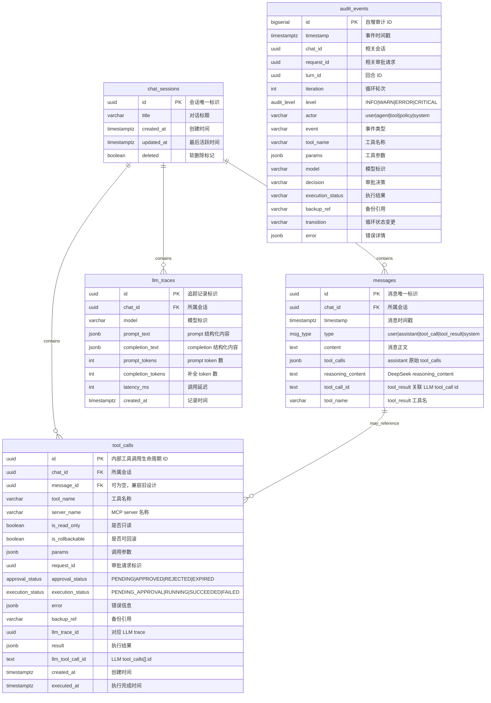

# 数据库设计

web-server 使用 PostgreSQL 作为持久化存储。会话、消息、工具调用生命周期、审计事件和 LLM 追踪写入数据库；审批等待本身由内存 `ApprovalBridge` 管理，不单独持久化为审批表。

## 设计原则

- **Schema 隔离**：web-server 独占 PostgreSQL 表，不与 tool-server 共享表空间
- **审计不可变**：`audit_events` 表仅 INSERT 和 SELECT，禁止 UPDATE/DELETE
- **JSONB 用于半结构化字段**：工具参数、工具结果、错误、LLM prompt/completion 使用 JSONB
- **历史可回放**：`messages` 保存 assistant `tool_calls`、`reasoning_content` 和 tool-result 关联字段，满足多轮 LLM 历史重建
- **软删除会话**：`DELETE /api/sessions/{chat_id}` 只设置 `chat_sessions.deleted=true`

## ER 图



## 表定义

### chat_sessions

| 列 | 类型 | 约束 | 说明 |
|----|------|------|------|
| `id` | `UUID` | PK | 会话唯一标识 |
| `title` | `VARCHAR(256)` | nullable | 后端使用首条用户消息第一行前 20 个字符自动生成；只在 title 为空时写入。前端收到 `session_init` 后会先用前 30 个字符生成本地临时标题 |
| `created_at` | `TIMESTAMPTZ` | NOT NULL, DEFAULT NOW() | 创建时间 |
| `updated_at` | `TIMESTAMPTZ` | NOT NULL, DEFAULT NOW() | 消息或工具调用生命周期更新时刷新 |
| `deleted` | `BOOLEAN` | NOT NULL, DEFAULT false | 软删除标记；会话列表只返回 `deleted=false` |

### messages

| 列 | 类型 | 约束 | 说明 |
|----|------|------|------|
| `id` | `UUID` | PK | 消息唯一标识 |
| `chat_id` | `UUID` | FK → chat_sessions, NOT NULL | 所属会话 |
| `timestamp` | `TIMESTAMPTZ` | NOT NULL | 消息时间戳 |
| `type` | `msg_type` | NOT NULL | user / assistant / tool_call / tool_result / system |
| `content` | `TEXT` | NOT NULL | 消息正文 |
| `tool_calls` | `JSONB` | nullable | assistant 消息中的 OpenAI tool_calls 原始结构 |
| `reasoning_content` | `TEXT` | nullable | DeepSeek thinking 模式要求回传的推理内容 |
| `tool_call_id` | `TEXT` | nullable | `tool_result` 消息关联的 LLM tool call id |
| `tool_name` | `VARCHAR(128)` | nullable | `tool_result` 消息关联的工具名 |

`is_meta` 已从运行时 schema 中移除。推理内容使用 `reasoning_content` 字段保存；审批状态通过 SSE 事件和 `tool_calls` 生命周期表达。

枚举：

```sql
CREATE TYPE msg_type AS ENUM ('user', 'assistant', 'tool_call', 'tool_result', 'system');
```

索引：

- `messages(chat_id, timestamp)`：按会话恢复历史消息

### tool_calls

| 列 | 类型 | 约束 | 说明 |
|----|------|------|------|
| `id` | `UUID` | PK | web-server 内部工具调用生命周期 ID，对应 Pydantic `ToolCall.call_id` |
| `chat_id` | `UUID` | FK → chat_sessions, NOT NULL | 所属会话 |
| `message_id` | `UUID` | nullable | 旧设计关联字段；当前运行时可为空 |
| `tool_name` | `VARCHAR(128)` | NOT NULL | 工具名称 |
| `server_name` | `VARCHAR(32)` | NOT NULL | MCP server 名称，当前主要为 `tool-server` |
| `is_read_only` | `BOOLEAN` | NOT NULL | 静态工具来自注册元数据；可变工具来自伴生分类结果 |
| `is_rollbackable` | `BOOLEAN` | NOT NULL | 当前仅记录元数据，不执行自动回滚 |
| `params` | `JSONB` | NOT NULL, DEFAULT '{}' | 调用参数 |
| `request_id` | `UUID` | nullable | 审批请求 ID；只读预执行工具可为空 |
| `approval_status` | `approval_status` | NOT NULL | PENDING / APPROVED / REJECTED / EXPIRED |
| `execution_status` | `execution_status` | NOT NULL | PENDING_APPROVAL / RUNNING / SUCCEEDED / FAILED |
| `error` | `JSONB` | nullable | 执行失败或拒绝时的错误信息 |
| `backup_ref` | `VARCHAR(256)` | nullable | 预留备份引用 |
| `llm_trace_id` | `UUID` | nullable | 触发该工具调用的 LLM trace |
| `result` | `JSONB` | nullable | 工具执行结果原始结构 |
| `llm_tool_call_id` | `TEXT` | nullable | LLM 返回的 `tool_calls[].id`，用于历史和 SSE 关联 |
| `created_at` | `TIMESTAMPTZ` | NOT NULL, DEFAULT NOW() | 创建时间 |
| `executed_at` | `TIMESTAMPTZ` | nullable | 执行完成或失败时间 |

枚举：

```sql
CREATE TYPE approval_status AS ENUM ('PENDING', 'APPROVED', 'REJECTED', 'EXPIRED');
CREATE TYPE execution_status AS ENUM ('PENDING_APPROVAL', 'RUNNING', 'SUCCEEDED', 'FAILED');
```

索引：

- `tool_calls(llm_trace_id)`：按 LLM trace 反查工具调用

### audit_events

| 列 | 类型 | 约束 | 说明 |
|----|------|------|------|
| `id` | `BIGSERIAL` | PK | 自增审计 ID |
| `timestamp` | `TIMESTAMPTZ` | NOT NULL | 事件时间戳 |
| `chat_id` | `UUID` | nullable | 相关会话 |
| `request_id` | `UUID` | nullable | 相关审批请求 |
| `turn_id` | `UUID` | nullable | Agent 回合 ID |
| `iteration` | `INTEGER` | nullable | AgentLoop 轮次 |
| `level` | `audit_level` | NOT NULL | INFO / WARN / ERROR / CRITICAL |
| `actor` | `VARCHAR(32)` | NOT NULL | user / agent / tool / policy / system |
| `event` | `VARCHAR(64)` | NOT NULL | 事件类型 |
| `tool_name` | `VARCHAR(128)` | nullable | 工具名称 |
| `params` | `JSONB` | nullable | 工具参数 |
| `model` | `VARCHAR(64)` | nullable | 模型标识 |
| `decision` | `VARCHAR(16)` | nullable | 审批决策 |
| `execution_status` | `VARCHAR(16)` | nullable | 执行结果 |
| `backup_ref` | `VARCHAR(256)` | nullable | 备份引用 |
| `transition` | `VARCHAR(32)` | nullable | AgentLoop 状态变更 |
| `error` | `JSONB` | nullable | 错误详情 |

枚举：

```sql
CREATE TYPE audit_level AS ENUM ('INFO', 'WARN', 'ERROR', 'CRITICAL');
```

### llm_traces

| 列 | 类型 | 约束 | 说明 |
|----|------|------|------|
| `id` | `UUID` | PK | 追踪记录标识 |
| `chat_id` | `UUID` | FK → chat_sessions, NOT NULL | 所属会话 |
| `model` | `VARCHAR(64)` | NOT NULL | 模型标识 |
| `prompt_text` | `JSONB` | NOT NULL | 发送给 LLM 的消息、工具和 system prompt |
| `completion_text` | `JSONB` | nullable | LLM 响应内容 |
| `prompt_tokens` | `INTEGER` | NOT NULL, DEFAULT 0 | prompt token 数 |
| `completion_tokens` | `INTEGER` | NOT NULL, DEFAULT 0 | completion token 数 |
| `latency_ms` | `INTEGER` | NOT NULL, DEFAULT 0 | 调用延迟 |
| `created_at` | `TIMESTAMPTZ` | NOT NULL, DEFAULT NOW() | 记录时间 |

## 写入策略

### chat-turn 写入流程

```
POST /api/chat
  ├─ 无 chat_id → INSERT chat_sessions
  ├─ 写入用户消息 → INSERT messages(type=user)
  ├─ LLM 流式完成 → INSERT llm_traces
  ├─ 若有 assistant 内容/tool_calls/reasoning
  │    → INSERT messages(type=assistant, tool_calls, reasoning_content)
  ├─ 新发现工具
  │    ├─ 静态只读预执行 → INSERT tool_calls(APPROVED, SUCCEEDED/FAILED, result)
  │    └─ 待审查工具 → INSERT tool_calls(PENDING, PENDING_APPROVAL)
  ├─ review_node
  │    ├─ 黑名单 → UPDATE tool_calls(REJECTED, FAILED)
  │    ├─ 只读/白名单 → UPDATE tool_calls(APPROVED, RUNNING)
  │    └─ 高风险 → SSE tool_approval_required，等待 ApprovalBridge
  ├─ 用户审批
  │    ├─ APPROVED → UPDATE tool_calls(APPROVED, RUNNING)
  │    ├─ REJECTED → UPDATE tool_calls(REJECTED, FAILED)
  │    └─ EXPIRED → UPDATE tool_calls(EXPIRED, FAILED)
  ├─ act_node 执行工具 → UPDATE tool_calls(SUCCEEDED/FAILED, result/error, executed_at)
  └─ observe_node 回写 tool 消息 → INSERT messages(type=tool_result, tool_call_id, tool_name)
```

### 各表写入规则

| 实体 | 写入时机 | 策略 |
|------|----------|------|
| `chat_sessions` | 新会话创建；消息或工具生命周期更新 | `INSERT` 后通过 `UPDATE updated_at` 刷新 |
| `messages` | 用户消息、assistant 消息、tool_result 消息产生时 | 仅追加 |
| `tool_calls` | LLM 产生工具调用后 | 先 INSERT，再随审批/执行生命周期 UPDATE |
| `audit_events` | 审查、审批、执行、transition、错误事件发生时 | 仅追加 |
| `llm_traces` | 每次 LLM 调用完成时 | 仅追加 |

### 运行时恢复边界

当前代码不实现启动扫描 `RUNNING` 记录并重放执行，也没有后台任务把长期 `RUNNING` 自动标记为 FAILED。若 web-server 在工具执行后、结果写回前崩溃，需通过审计日志和宿主状态人工排查。

## 审计日志格式

每条审计事件写入 `audit_events` 表，示例：

```json
{
  "timestamp": "2026-05-07T12:00:00Z",
  "chat_id": "<chat-uuid>",
  "request_id": "<request-uuid>",
  "turn_id": "<turn-uuid>",
  "iteration": 3,
  "level": "INFO",
  "actor": "policy",
  "event": "TOOL_AUTO_APPROVED",
  "tool_name": "get_cpu_info",
  "params": {},
  "model": "deepseek-v4",
  "decision": "APPROVED",
  "execution_status": "SUCCEEDED",
  "transition": "tool_results",
  "error": null
}
```

审计日志由 web-server 统一写入，tool-server 不直接写审计表。
