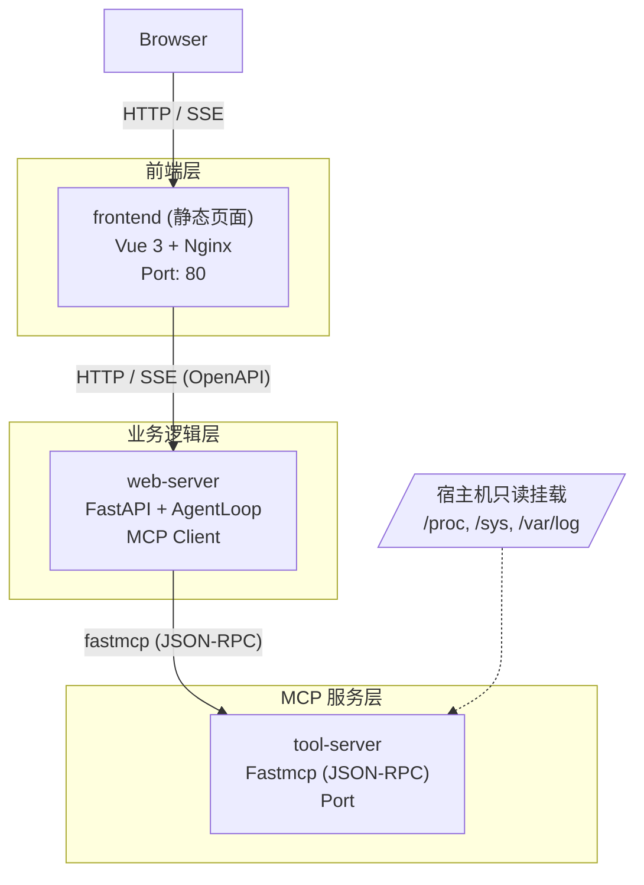

# 概要设计

## 设计原则

- **SRP（单一职责）**
- **KISS（保持简单）**
- **DRY（避免重复）**
- **TDD（测试驱动开发）**

## 服务拓扑



- **frontend**（Vue 3 + Bootstrap 5 + Nginx）：纯静态聊天界面。Vite 构建为静态文件，Nginx serve 静态资源 + 反向代理 `/api/*` 到 web-server。
- **web-server**（FastAPI + AgentLoop + fastmcp Client）：核心编排层。接收用户消息，驱动 Agent 循环（ReAct），作为 MCP Client 调用 tool-server 的 MCP 工具。对外暴露 OpenAPI 端点，支持 SSE 流式响应。
- **tool-server**（fastmcp Server）：提供系统感知工具（CPU/内存/磁盘/网络/进程/日志采集）和运维操作工具（bash、systemd）。负责根据工具参数动态判定操作安全分级（isReadOnly / isRollbackable）。Docker 容器运行，通过挂载权限与 Linux capabilities 约束最小权限。
## 技术选型与依赖

| 服务 | 运行时依赖 |
|------|-----------|
| frontend | vue3, bootstrap5, vite, marked.js, nginx |
| web-server | fastapi, AgentLoop, fastmcp, openai, asyncpg, uvicorn, sse-starlette |
| tool-server | fastmcp, psutil, systemd-python |


## 服务职责

各服务的完整职责见对应 README：`frontend/README.md`、`web-server/README.md`、`tool-server/README.md`。

## 逻辑分层

### 编排层

- **Agent 循环**：驱动 ReAct（Thought → Action → Observation），每轮迭代流式推送中间状态到前端。所有事件（文本、工具调用、审批请求）通过单一 SSE 连接传输，SSE 流不中断。LLM 自主判断任务完成后退出循环。
- **只读预执行**：LLM 输出完成后，think 节点对静态只读 tool_call 并行预执行，减少端到端延迟。
- **Context Manager**：每轮 LLM 调用前主动检查 token 用量，必要时压缩早期消息后再送入 LLM。
- **Router**：判断当前输出是文本、工具调用还是审批等待

### 审查层

web-server 统一拦截所有 tool_call，不可绕过。静态工具直接使用注册元数据（is_read_only / is_rollbackable），可变工具通过伴生分类工具动态判定分级，再结合规则匹配决定：只读/白名单放行，高风险生成 ToolRequest 等用户确认。分级逻辑内置于 tool-server 的工具实现中，web-server 不做参数级别的风险判断。

tool-server 收到执行请求时进行**安全校验**：验证 `approval_status == APPROVED` 且 `request_id` 有效，不通过则拒绝并记录 SECURITY_VIOLATION。

### MCP 工具层

fastmcp Client 连接 tool-server，发现并注册 MCP tool，发起 JSON-RPC 调用并解析 ToolResult。

### 日志层

- **应用日志**：`servers.log`
- **审计日志**：PostgreSQL `audit_events` 表，仅 INSERT/SELECT。事件定义见 `doc/详细设计.md`
- **LLM 追踪**：自建 `llm_traces` 表，记录每次 LLM 调用的 model、token 消耗、延迟和响应内容
- **错误日志**：内存环形缓冲 + 持久化文件，MCP 通信错误独立存储。依赖注入就绪前即可安全调用
- **检查点剖析器**：环境变量门控（`ALASCUP_PROFILE=1`），记录 agent 循环各阶段耗时，自动标记慢操作
- **调试日志**：分级（DEBUG/INFO/WARN/ERROR），环境变量门控（`ALASCUP_AGENT_TRACE=1`），输出到 `logs/debug/` 并维护 `latest` symlink。记录 Agent 决策叙事而非原始数据

## 通信协议

| 通信路径 | 协议 | 说明 |
|----------|------|------|
| Browser ↔ frontend | HTTP | 静态资源 + Nginx 反向代理到 web-server |
| frontend ↔ web-server | HTTP REST + SSE | OpenAPI 规范，SSE 用于流式聊天（含审批） |
| web-server → tool-server | JSON-RPC (fastmcp) | MCP 协议，web-server 作为 Client |
| web-server → LLM | HTTP (OpenAI 兼容) | API Key 认证 |

SSE 事件类型：`session_init`（连接初始化返回 chat_id）、`reasoning`（推理内容 delta）、`thinking_done`（推理结束）、`assistant`（文本 delta）、`assistant_done`（回复结束）、`tool_call`（工具请求）、`tool_result`（执行结果）、`tool_approval_required`（高风险工具审批请求）、`error`、`done`（流结束）。所有事件通过同一 SSE 连接传输，连接不中断。审批决策通过 REST 端点 `POST /api/tool-requests/{request_id}/approval` 传入。LLM 调用产生的可恢复错误（prompt_too_long / max_output_tokens / server_error / model_unavailable）先尝试恢复，恢复成功不产生 `error` 事件，恢复失败才推送。

## 数据流概要

```
用户消息 → web-server
            ├─ 注入 system prompt + 上下文
            ├─ Agent 节点调用 LLM
            ├─ LLM 返回 tool_call
            ├─ 审查层（所有 tool_call 统一入口）
            │   ├─ 向 tool-server 查询分级（isReadOnly / isRollbackable）
            │   ├─ 规则匹配（whitelist / blacklist / 默认策略）
            │   ├─ 只读/白名单 → 放行，记录审计日志
            │   └─ 高风险 → 生成 ToolRequest → 用户确认 → 审查通过，记录审计日志
            ├─ 调用 tool-server 执行（tool-server 执行前安全校验）
            ├─ Agent 节点根据结果继续推理或返回最终回复
            └─ SSE 流式推送给前端
所有工具调用均经审查层并记录审计日志（web-server 负责）。

LLM 单次可生成多个 tool_call。只读 tool_call 并行执行；高风险 tool_call 串行排队，依次审批。
```
