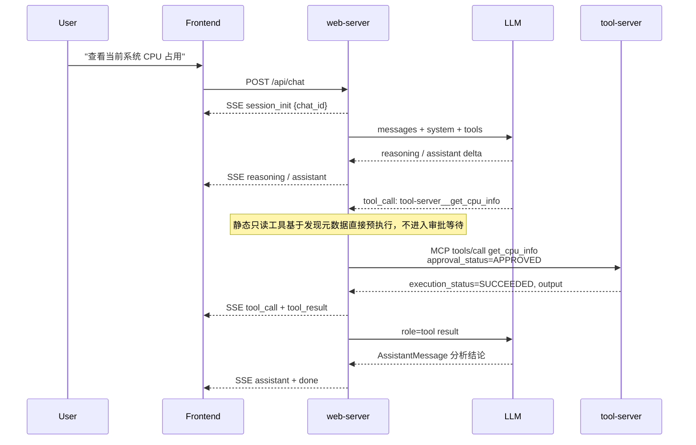
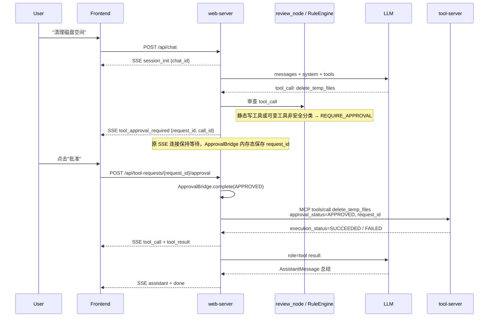
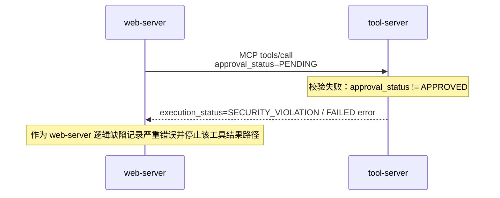
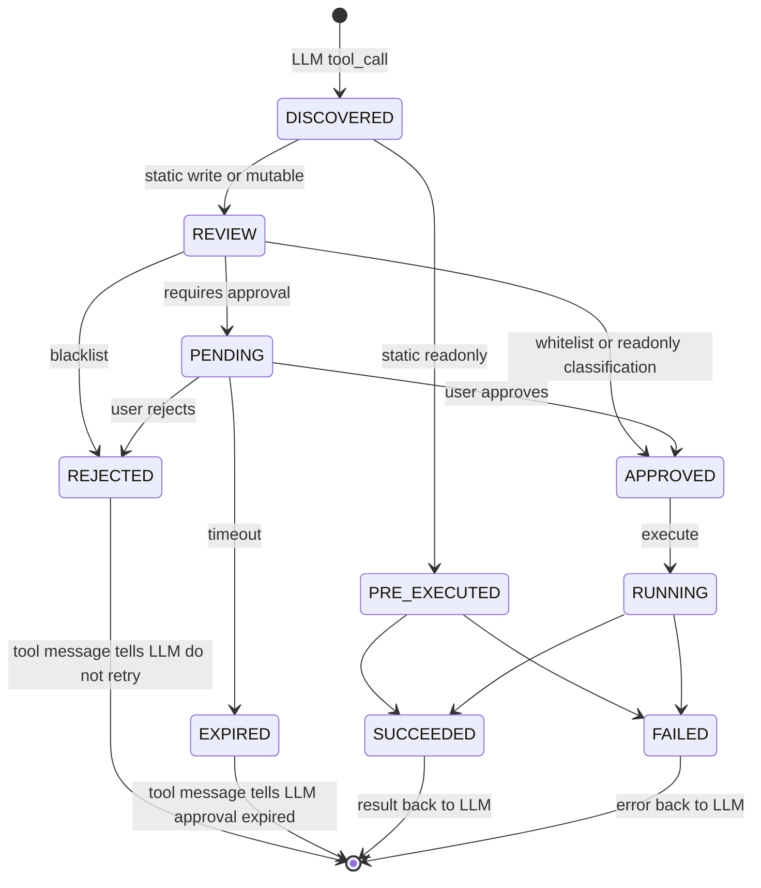

# 详细设计

## 文档目标

定义项目中各服务共享的数据结构、状态机、接口契约和跨服务流程。单个服务内部实现细节放在各自 `README.md` 和 `graph.md` 中。

## 文档边界

- 写跨服务必须遵守的契约：数据结构、协议、状态、错误处理、审查规则、审计要求
- 不写单服务内部实现细节：Agent 节点拓扑、SSE 组包策略、Prompt 组装算法、具体工具执行逻辑
- web-server 内部流程图见 `web-server/graph.md`
- tool-server 工具与安全校验见 `tool-server/README.md`

## 完整交互时序

### 场景一：静态只读诊断



### 场景二：高风险操作审批



### 场景三：安全违规路径



## 命名规范

所有数据结构字段、Python 变量、数据库列名统一使用 **snake_case**。JSON 序列化直接使用字段名，不做别名转换。

## 基础数据结构

### Message

```
Message {
  message_id: string (UUID)
  chat_id: string (UUID)
  timestamp: string (RFC 3339)
  type: string [user | assistant | tool_call | tool_result | system]
  content: string
  tool_calls: object[] | null
  tool_call_id: string | null
  tool_name: string | null
  reasoning_content: string | null
}
```

| 字段 | 说明 |
|------|------|
| `type: user` | 用户输入 |
| `type: assistant` | LLM 文本回复；可携带 `tool_calls` 和 `reasoning_content` |
| `type: tool_call` | 兼容旧类型；当前运行时主要通过 assistant `tool_calls` 保存工具请求 |
| `type: tool_result` | 工具执行结果；`tool_call_id` 与 LLM tool call id 对齐 |
| `type: system` | 系统通知 |
| `reasoning_content` | DeepSeek thinking 模式要求回传的推理内容，不再使用 `is_meta` |

SSE 流式传输时工具调用和工具结果通过事件 data 获取结构化信息；加载历史时，web-server 将 `messages` 和必要的 `tool_calls` 记录投影为 LLM 可接受的 history。

### Tool

```
Tool {
  name: string
  server_name: string
  description: string
  params_schema: object
  mutable: boolean
  is_read_only: boolean
  is_rollbackable: boolean
}
```

tool-server 通过 fastmcp 工具元数据携带 `mutable`、`is_read_only`、`is_rollbackable`、`hidden` 等字段；web-server 的工具发现缓存将其展平为 LLM 和审查层使用的工具对象。

| 类型 | `mutable` | 分级方式 |
|------|-----------|----------|
| 静态工具 | `false` | 注册时声明 `is_read_only` / `is_rollbackable`，web-server 直接使用 |
| 可变工具 | `true` | 运行时调用伴生分类工具 `{tool_name}_classify`，返回 `{"safe": bool}` |

### 伴生分类工具

每个可变工具自动注册伴生 MCP 工具，命名规则为 `{tool_name}_classify`。伴生工具必须标记：

```
meta.hidden = true
meta.mutable = false
meta.is_read_only = true
```

`hidden=true` 的工具不暴露给 LLM，但保留在 web-server 内部工具缓存中供 `ToolExecutor.classify_companion()` 调用。

### ToolCall

```
ToolCall {
  // 继承 Tool 的属性
  chat_id: string (UUID)
  message_id: string (UUID | null)
  call_id: string (UUID | null)          // web-server 内部生命周期 ID
  llm_trace_id: string (UUID | null)
  llm_tool_call_id: string | null        // LLM tool_calls[].id
  params: object
  request_id: string (UUID | null)
  approval_status: string [PENDING | APPROVED | REJECTED | EXPIRED]
  execution_status: string [PENDING_APPROVAL | RUNNING | SUCCEEDED | FAILED]
  error: object | null
  result: object | null
  timestamp: string (RFC 3339)
}
```

`tool_name` 是 `name` 的前端兼容 computed 字段。`executed_tool_list` 可能包含待审批、运行中、成功、失败、拒绝或过期的工具生命周期记录，不只包含已执行完成记录。

### ToolRequest

审批请求是内存态等待对象。它通过 SSE `tool_approval_required` 暴露给前端，通过 REST 审批端点回写决策，不单独持久化为独立表。

```
ToolRequest {
  request_id: string (UUID)
  chat_id: string (UUID)
  message_id: string (UUID)
  params: object
  approval_status: string [PENDING | APPROVED | REJECTED | EXPIRED]
  created_at: string (RFC 3339)
  approved_at: string (RFC 3339 | null)
  expired_at: string (RFC 3339 | null)
  rejected_reason: string | null
}
```

### ChatSession

```
ChatSession {
  chat_id: string (UUID)     // Pydantic 内部字段为 id，序列化别名为 chat_id
  title: string | null
  messages: Message[]
  executed_tool_list: ToolCall[]
  timestamp: string (RFC 3339)
  deleted: boolean
}
```

会话创建由 `POST /api/chat` 缺省 `chat_id` 时自动完成；当前没有 `POST /api/sessions` 接口。`DELETE /api/sessions/{chat_id}` 是软删除。

## SSE 事件契约

`POST /api/chat` 返回 `text/event-stream`。首事件必须是 `session_init`，末事件必须是 `done`。

| event | data | 说明 |
|-------|------|------|
| `session_init` | `{chat_id}` | 建立流后立即返回真实 UUID |
| `reasoning` | `{delta}` | LLM `reasoning_content` 增量 |
| `thinking_done` | `{}` | 当前推理片段结束 |
| `assistant` | `{delta}` | LLM 正文增量 |
| `assistant_done` | `{}` | assistant 消息边界 |
| `tool_call` | `{call_id, tool_name, params, is_read_only, server}` | 工具开始执行或展示 |
| `tool_result` | `{call_id, execution_status, output?, error?, execution_time_ms?}` | 工具执行结果；`output` 当前通常为 MCP 文本输出字符串，也允许工具自定义结构 |
| `tool_approval_required` | `{chat_id, request_id, tool_name, params, reason, call_id}` | 高风险工具等待审批 |
| `error` | `{code, message}` | turn 级错误 |
| `done` | `{}` | 流结束；断连或异常路径也会在 finally 中发送 |

前端不得依赖 `X-Session-ID` header；session ID 只从 `session_init` 获取。

## System Prompt 结构

System prompt 由多个命名 section 按固定顺序组装为单一 prompt 注入 LLM：

`identity → rules → tool_usage → environment → memory`

| Section | 类别 | 职责 |
|---------|------|------|
| `identity` | 静态 | Agent 角色身份与核心能力描述 |
| `rules` | 静态 | 强制遵守的行为规则 |
| `tool_usage` | 静态 | 工具调用规范、并行策略、错误处理 |
| `environment` | 动态 | 目标系统静态信息；动态指标通过工具按需获取 |
| `memory` | 动态 | 持久记忆内容 |

当前运行时默认使用 `PromptManager` 内置 section；可通过构造 `PromptManager(prompt_path=...)` 覆盖，但生产启动路径默认不加载 `prompt.md`。

## 操作分级规则

分级来源：

- 静态工具：工具注册元数据 `is_read_only` / `is_rollbackable`
- 可变工具：伴生分类工具 `{tool_name}_classify` 返回 `{"safe": bool}`

规则引擎只按工具名匹配 `rules.json`：

| 判定顺序 | 条件 | 行为 |
|----------|------|------|
| 1 | 工具名在 blacklist | `REJECT`，不执行 |
| 2 | 工具名在 whitelist | `AUTO_APPROVE` |
| 3 | `is_read_only=true` | `AUTO_APPROVE` |
| 4 | 其他 | `REQUIRE_APPROVAL` |

可变工具分类失败时 fail-closed，按 `safe=false` 进入审批路径。

## MCP 通信协议

web-server 与 tool-server 通过 fastmcp 调用 MCP `tools/call`。

### 伴生分类工具调用

web-server 调用 `{tool_name}_classify` 查询可变工具安全性。

```json
{
  "jsonrpc": "2.0",
  "method": "tools/call",
  "params": {
    "name": "bash_classify",
    "arguments": { "command": "rm -rf /var/lib/mysql" }
  },
  "id": 1
}
```

伴生工具的文本内容应能解析为：

```json
{ "safe": false }
```

解析失败、调用失败、字段缺失均视为 `safe=false`。

### 工具执行调用

所有工具执行都通过 MCP `tools/call` 调用真实工具名。web-server 在调用参数外层维护以下执行元数据：

```
tool_name
arguments
server_name
approval_status
request_id
```

当前 `ToolExecutor.execute()` 要求 `approval_status == APPROVED`，否则本地返回安全违规结果，不向 MCP server 发起执行。只读预执行工具也会携带 `approval_status=APPROVED` 和生成的 `request_id`。

成功结果规范：

```json
{
  "execution_status": "SUCCEEDED",
  "output": "..."
}
```

失败结果规范：

```json
{
  "execution_status": "FAILED",
  "error": { "message": "..." }
}
```

## 审查与执行流程

1. LLM 返回 tool_calls 后，web-server 解析 `server__tool` 前缀并补齐工具元数据
2. 静态只读工具直接并行预执行，生成 `streaming_tool_results`
3. 静态写工具和可变工具进入审查层
4. 可变工具调用伴生分类工具；分类失败按危险处理
5. `RuleEngine.evaluate()` 按 blacklist、whitelist、只读、默认审批的顺序决策
6. 自动批准工具进入 `act_node` 并行执行
7. 高风险工具通过 SSE `tool_approval_required` 等待用户审批
8. 用户审批通过后执行；拒绝或超时则生成 LLM 可见的 tool-result 拒绝消息

默认审批等待超时为 300 秒。测试可通过 mock 或依赖注入缩短等待，不依赖生产配置文件自动切换。

### ToolRequest / ToolCall 状态机



`SECURITY_VIOLATION` 是工具执行返回中的错误语义，不是数据库 `execution_status` 枚举值；持久化时映射为 `FAILED` 并携带 error。

## 错误处理

### MCP 调用层

| 场景 | 策略 |
|------|------|
| 连接错误 | 最多重试 2 次，间隔 1s / 2s；仍失败则返回 `FAILED` |
| 调用超时或运行时错误 | 不重试，返回 `FAILED` |
| 伴生分类失败 | fail-closed，视为 `safe=false` |
| `approval_status != APPROVED` | 本地返回 `SECURITY_VIOLATION` 语义错误 |

业务级重试由 Agent/LLM 决定；MCP 客户端只做传输层最小重试。

### Agent 熔断

| 熔断 | 默认值 | 行为 |
|------|--------|------|
| 最大迭代轮次 | 30 | 触发 `TURN_LIMIT_EXCEEDED` SSE error 并退出 |
| Token 硬上限 | context window × 0.95 | 压缩后仍超限时触发 `TOKEN_BUDGET_EXCEEDED` |

当前不实现“轮次到达后等待用户确认继续”的交互式暂停。

### 服务崩溃恢复

当前代码不实现启动扫描 `RUNNING` tool_calls 并重放执行，也不实现后台兜底任务。若 web-server 在工具执行后、结果写回前崩溃，可能留下 `RUNNING` 记录，需要人工根据 `audit_events`、`tool_calls` 和宿主状态排查。

### LLM 错误分类与恢复

LLM Adapter 将错误映射为标准分类：

| 分类标签 | 触发条件 | 当前恢复策略 |
|----------|----------|--------------|
| `prompt_too_long` | 400/413 且上下文过长相关 | 压缩上下文；仍失败则激进压缩 |
| `max_output_tokens` | stop_reason=max_tokens | 提升 max_tokens；仍失败则最多 3 次注入 continue |
| `model_unavailable` | 404 | 若配置 fallback model，则切换 |
| `server_error` | 5xx / 529 | 若配置 fallback model，则切换 |
| `rate_limit` | 429 | 不恢复，表面错误 |
| `auth_failed` | 401 / 403 | 不恢复，表面错误 |
| `timeout` | status_code=0 | 不恢复，表面错误 |
| `unknown` | 其他 4xx/异常 | 不恢复，表面错误 |

`llm_traces` 当前记录 prompt、completion、token 和 latency；不包含独立的 `error_type` / `error_details` 列。

## 可观测性

| 系统 | 存储 | 内容 | 详见 |
|------|------|------|------|
| 审计日志 | PostgreSQL `audit_events` | 审查决策、审批、执行结果、transition、错误事件 | `docs/数据库设计.md` |
| LLM 追踪 | PostgreSQL `llm_traces` | 每次 LLM 调用的 prompt、completion、token、延迟 | `docs/数据库设计.md` |
| 应用日志 | `logs/app/` | 启动、关闭、错误、警告 |
| 调试日志 | `logs/debug/` 或内存环形缓冲 | Agent 决策与调试轨迹，环境变量门控 | `web-server/README.md` |
| 检查点剖析器 | `logs/debug/` | Agent 循环阶段耗时，`ALASCUP_PROFILE=1` 启用 | `web-server/README.md` |

## 子项目文档

- `web-server/README.md`：Agent 循环、审查层、SSE 事件、配置、可观测性
- `web-server/graph.md`：web-server 内部流程图
- `tool-server/README.md`：工具列表、安全校验逻辑
- `frontend/README.md`：前端组件结构、接口消费、测试说明
- `frontend/graph.md`：前端模块依赖、聊天流、会话流、审批流
- `docs/数据库设计.md`：数据库 Schema
- `docs/api-spec/openapi.yaml`：REST + SSE 契约
