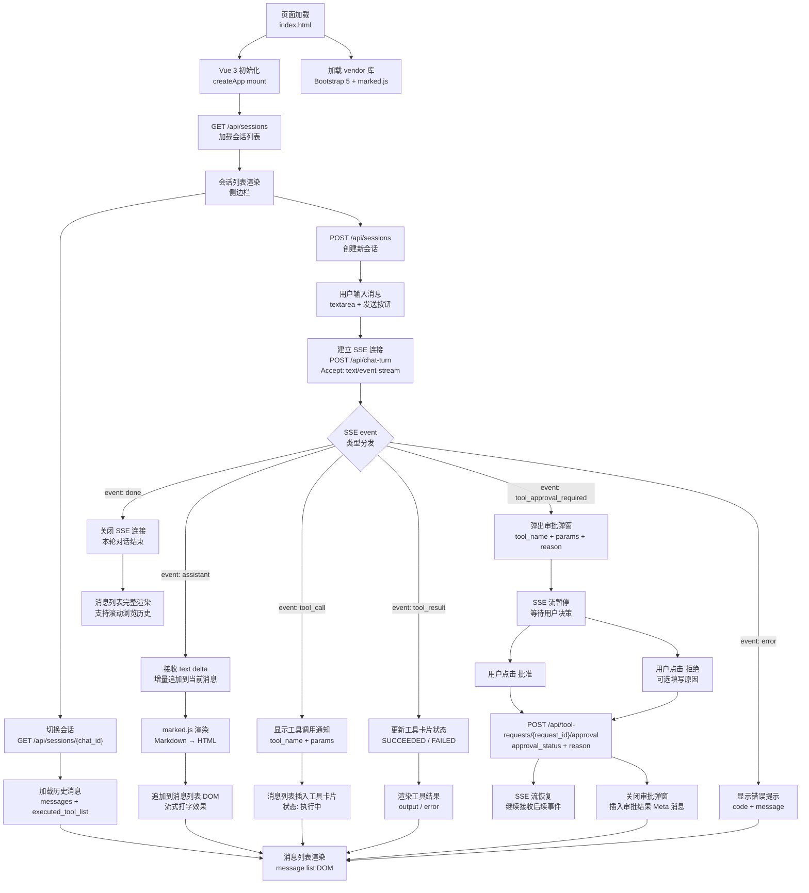
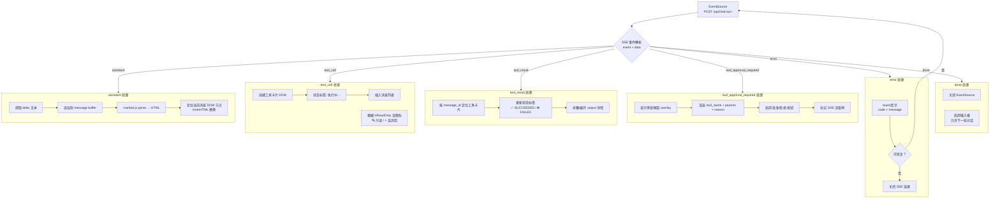
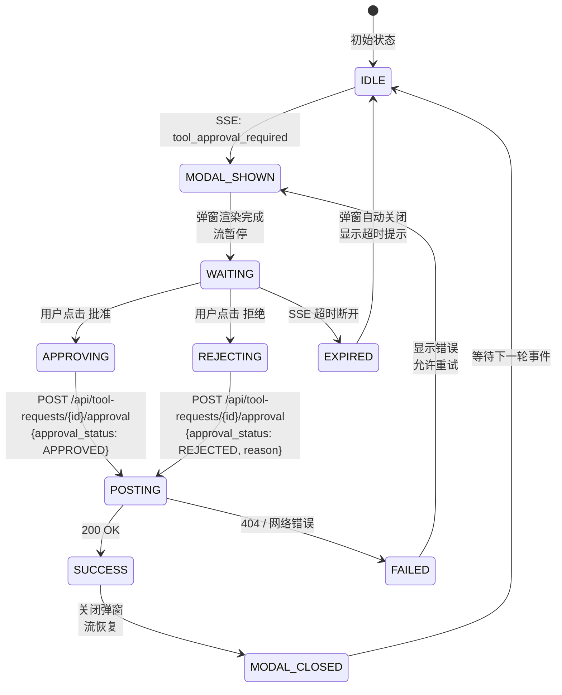
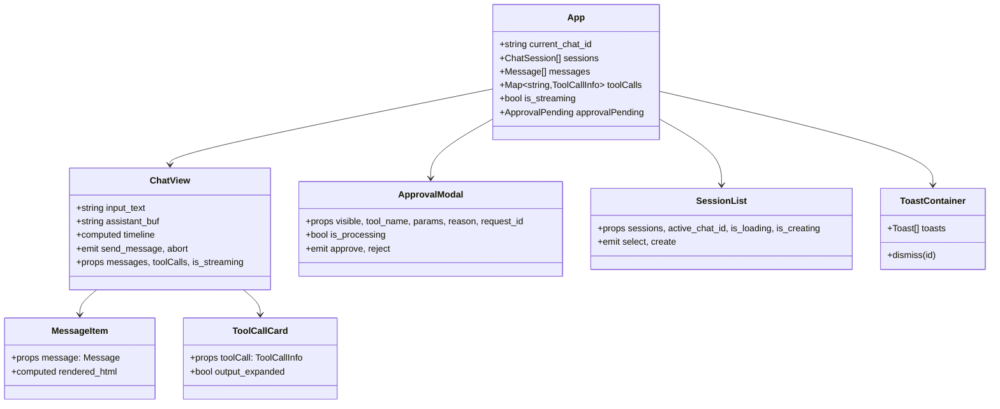
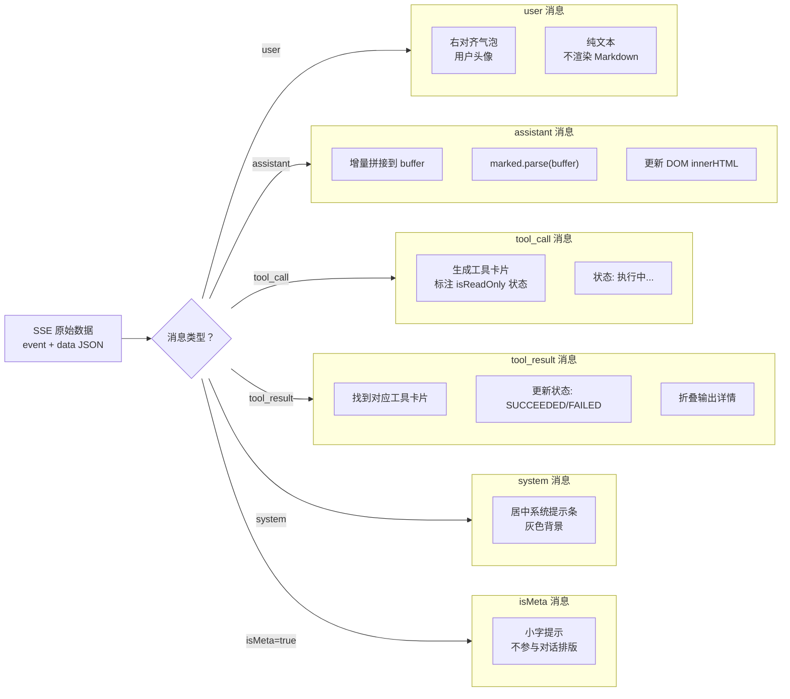

# frontend 流程图

## 总览：用户交互全链路



---

## SSE 事件处理流程



---

## 审批交互流程



---

## 模块依赖图

```mermaid
flowchart LR
    %% 声明
    subgraph entry["入口"]
        index["index.html<br/>Alpine.js 单页应用"]
    end

    subgraph vendor["第三方库"]
        vue["Vue 3<br/>组件化框架"]
        bootstrap["Bootstrap 5<br/>UI 样式"]
        marked["marked.js<br/>Markdown 渲染"]
    end

    subgraph composables["Composables"]
        useSSE["useSSE.ts<br/>SSE 连接"]
        useChat["useChat.ts<br/>聊天状态管理"]
        useSessions["useSessions.ts<br/>会话管理"]
    end

    subgraph components["Vue 组件"]
        chatview["ChatView.vue<br/>聊天界面 + SSE"]
        approval_modal["ApprovalModal.vue<br/>审批弹窗"]
        toolcall_card["ToolCallCard.vue<br/>工具执行卡片"]
        message_item["MessageItem.vue<br/>消息渲染"]
        session_list["SessionList.vue<br/>会话侧边栏"]
        toast_container["ToastContainer.vue<br/>Toast 通知"]
    end

    subgraph external["外部依赖"]
        nginx["Nginx<br/>静态文件 serve<br/>+ /api/* 反代"]
        webapi["web-server<br/>OpenAPI 端点"]
    end

    %% 连线
    index --> vue
    index --> bootstrap
    index --> marked
    index --> chatview
    index --> approval_modal
    index --> session_list

    chatview --> message_item: 消息渲染
    chatview --> toolcall_card: 工具卡片渲染
    chatview --> useSSE: SSE 连接
    chatview --> webapi: fetch + ReadableStream
    chatview --> webapi: GET/POST /api/sessions

    approval_modal --> webapi: POST /api/tool-requests/{id}/approval

    useSSE --> webapi: POST /api/chat-turn (SSE)
    useChat --> useSSE: SSE events
    useChat --> useSessions: active chat ID

    toast_container --> useToast: toast 队列

    nginx --> index: serve 静态文件
    nginx --> webapi: 反向代理 /api/*
```

---

## Vue 组件树与数据流



---

## 消息渲染管道


