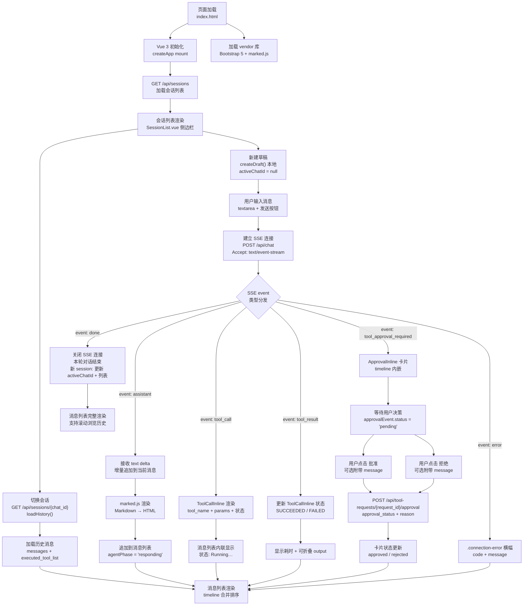
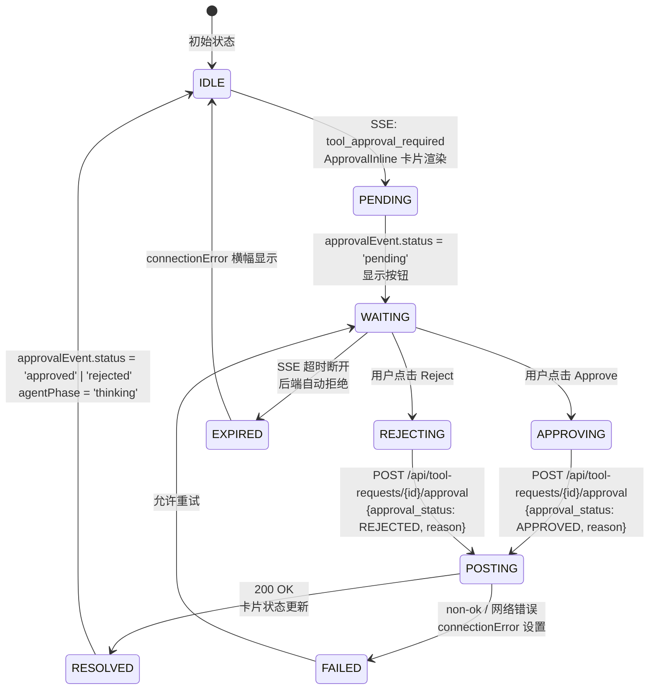
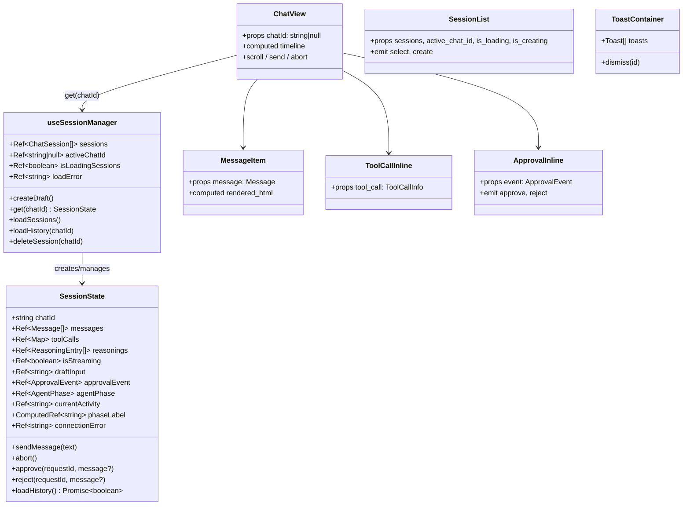
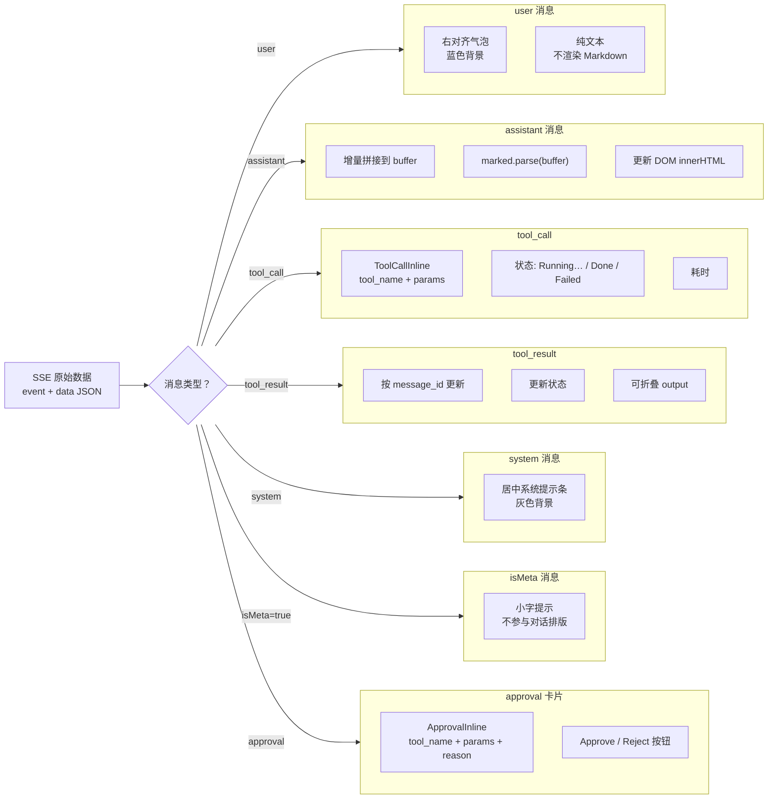

# frontend 流程图

## 总览：用户交互全链路



---

## SSE 事件处理流程

```mermaid
flowchart TD
    sse_stream["fetchEventSource<br/>POST /api/chat"]
    event_parse{"SSE 事件解析<br/>event + data"}

    subgraph handler_assistant["assistant 处理"]
        as_delta["提取 delta 文本"]
        as_buf["追加到 message buffer"]
        as_md["marked.js parse → HTML"]
        as_phase["agentPhase = 'responding'"]
    end

    subgraph handler_toolcall["tool_call 处理"]
        tc_create["创建 ToolCallInfo"]
        tc_map["插入 toolCalls Map"]
        tc_phase["agentPhase = 'calling_tool'<br/>currentActivity = tool_name"]
    end

    subgraph handler_toolresult["tool_result 处理"]
        tr_find["按 message_id 定位"]
        tr_update["更新执行状态<br/>SUCCEEDED / FAILED"]
        tr_elapsed["记录 execution_time_ms"]
    end

    subgraph handler_approval["tool_approval_required 处理"]
        ha_set["approvalEvent = { status: 'pending' }"]
        ha_phase["agentPhase = 'awaiting_approval'"]
        ha_card["ApprovalInline 渲染按钮"]
    end

    subgraph handler_error["error 处理"]
        he_banner["connectionError 设置<br/>.connection-error 横幅"]
        he_stream["isStreaming = false"]
    end

    subgraph handler_done["done 处理"]
        hd_phase["agentPhase = 'done'"]
        hd_stream["isStreaming = false"]
        hd_new{"新 session?"}
        hd_assign["_transitionDraftToReal()<br/>更新 activeChatId + sessions 列表"]
        hd_input["输入框保持可用"]
    end

    sse_stream --> event_parse
    event_parse -- "assistant" --> handler_assistant
    event_parse -- "tool_call" --> handler_toolcall
    event_parse -- "tool_result" --> handler_toolresult
    event_parse -- "tool_approval_required" --> handler_approval
    event_parse -- "error" --> handler_error
    event_parse -- "done" --> handler_done

    as_delta --> as_buf --> as_md --> as_phase
    tc_create --> tc_map --> tc_phase
    tr_find --> tr_update --> tr_elapsed
    ha_set --> ha_phase --> ha_card
    he_banner --> he_stream
    hd_phase --> hd_stream
    hd_stream --> hd_new
    hd_new -- "是" --> hd_assign --> hd_input
    hd_new -- "否" --> hd_input
```



---

## 审批交互流程



---

## 模块依赖图

```mermaid
flowchart LR
    subgraph entry["入口"]
        index["index.html<br/>Vue 3 单页应用"]
    end

    subgraph vendor["第三方库"]
        vue["Vue 3<br/>组件化框架"]
        bootstrap["Bootstrap 5<br/>UI 样式"]
        marked["marked.js<br/>Markdown 渲染"]
        highlightjs["highlight.js<br/>代码语法高亮"]
    end

    subgraph composables["Composables"]
        manager["useSessionManager.ts<br/>统一会话管理<br/>per-session state / SSE / 审批 / 列表"]
        toast["useToast.ts<br/>Toast 通知队列<br/>按 session 过滤"]
    end

    subgraph components["Vue 组件"]
        chatview["ChatView.vue<br/>时间线渲染 + 状态栏"]
        message_item["MessageItem.vue<br/>消息渲染"]
        toolcall_inline["ToolCallInline.vue<br/>工具调用内联文本"]
        reasoning_bubble["ReasoningBubble.vue<br/>推理过程气泡"]
        approval_inline["ApprovalInline.vue<br/>审批内联卡片"]
        session_list["SessionList.vue<br/>会话侧边栏"]
        toast_container["ToastContainer.vue<br/>Toast 通知"]
    end

    subgraph external["外部依赖"]
        nginx["Nginx<br/>静态文件 serve<br/>+ /api/* 反代"]
        webapi["web-server<br/>OpenAPI 端点"]
    end

    index --> vue
    index --> bootstrap
    index --> marked
    index --> highlightjs
    index --> chatview
    index --> session_list

    chatview --> message_item: 消息渲染
    chatview --> toolcall_inline: 工具调用渲染
    chatview --> reasoning_bubble: 推理渲染
    chatview --> approval_inline: 审批渲染
    chatview --> manager: get(chatId)

    session_list --> manager: sessions / activeChatId / createDraft

    approval_inline --> manager: approve / reject

    toast_container --> toast: toast 队列

    manager --> webapi: GET/POST /api/sessions
    manager --> webapi: POST /api/chat (SSE)
    manager --> webapi: POST /api/tool-requests/{id}/approval

    nginx --> index: serve 静态文件
    nginx --> webapi: 反向代理 /api/*
```

---

## Vue 组件树与数据流



---

## 消息渲染管道


