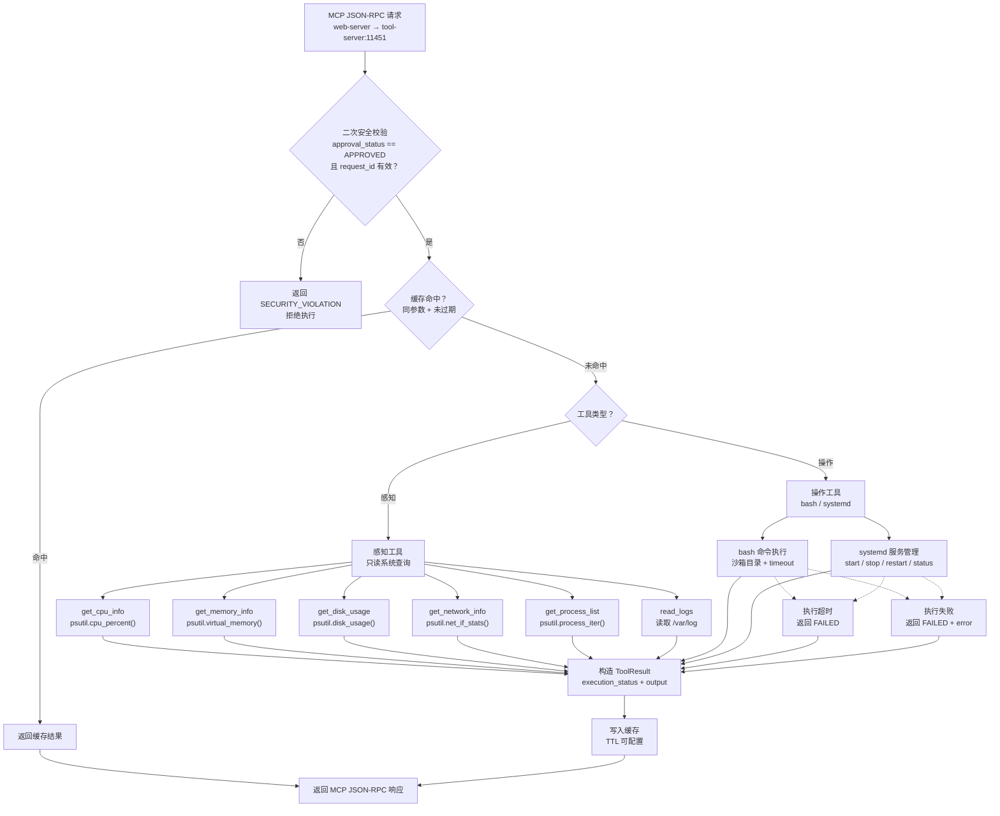
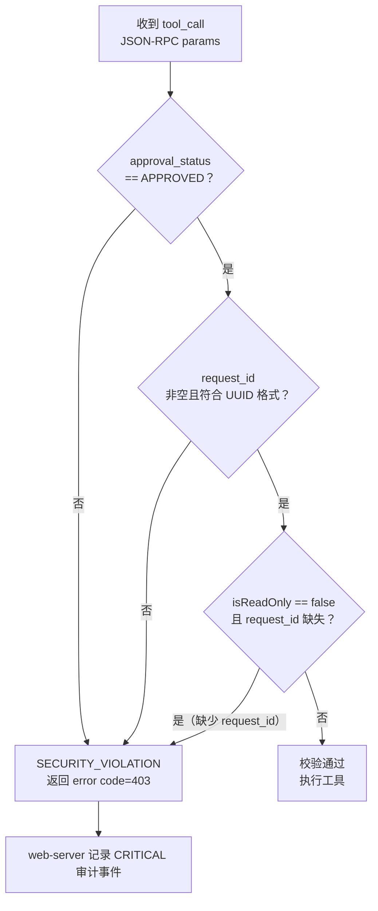
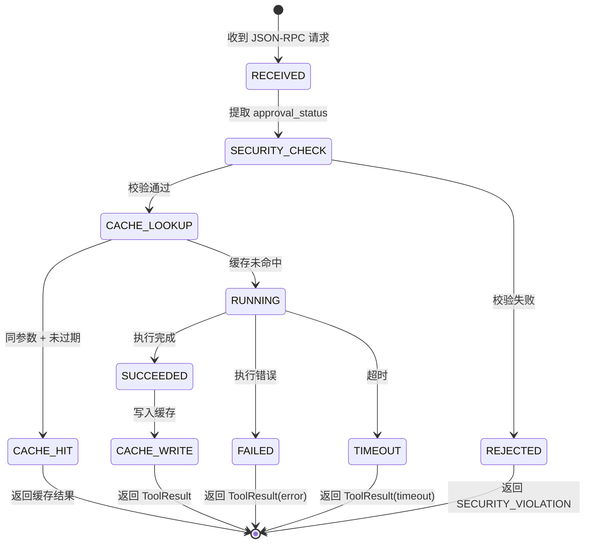
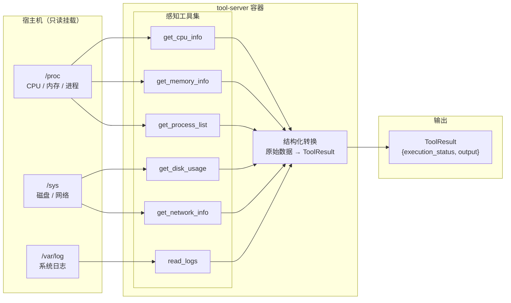
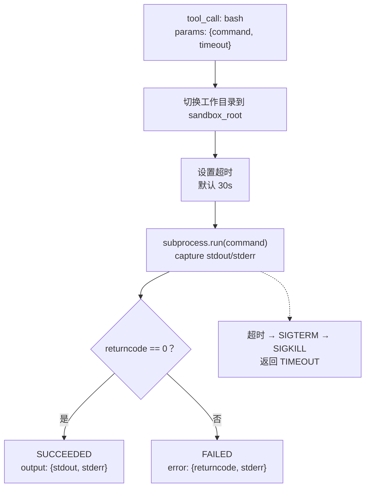
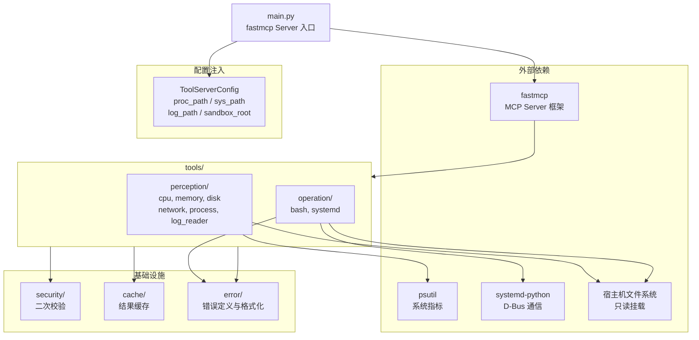
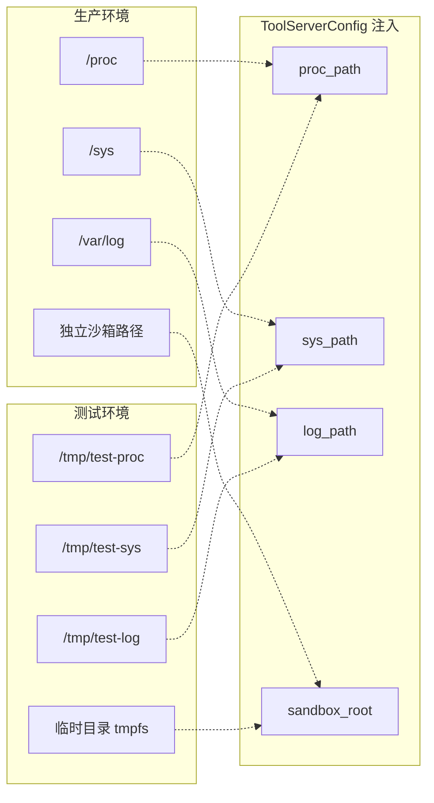

# tool-server 流程图

## 总览：工具请求处理全链路

---

## 二次安全校验（防御性校验）

tool-server 不查询 web-server 的状态机，仅做本地格式与字段校验。

> 强校验（request_id 是否对应一个真实的 APPROVED 状态的 ToolRequest）由 web-server 保证。tool-server 仅防御 web-server 绕过审批或代码 bug 导致未审批请求漏过来。

---

## 工具执行状态机

---

## 感知工具数据流

---

## 操作工具执行流程（bash）

---

## 模块依赖图

---

## 依赖注入与测试替换

