# web-server 流程图

## 总览：请求处理全链路

```mermaid
flowchart TD
    %% ============================================================
    %% 1. 节点声明（Declaration）
    %% ============================================================

    %% ── API 入口层 ──
    api_chat_turn["POST /api/chat<br/>聊天回合（SSE 流式）"]
    api_sessions_list["GET /api/sessions<br/>会话列表"]
    api_sessions_create["POST /api/sessions<br/>创建会话"]
    api_session_detail["GET /api/sessions/{chat_id}<br/>会话详情"]
    api_tools["GET /api/tools<br/>工具列表"]
    api_toolreq_approval["POST /api/tool-requests/{request_id}/approval<br/>审批回调"]
    api_health["GET /api/health<br/>健康检查"]

    %% ── 服务层 ──
    svc_session_mgr["Session Manager<br/>加载 / 创建 ChatSession"]
    svc_prompt_mgr["Prompt Manager<br/>组装 system prompt（section-based）"]
    svc_llm_adapter["LLM Adapter<br/>OpenAI 兼容调用"]

    %% ── Agent 编排层（ReAct 循环）──
    agent_state[(Agent State<br/>消息 + 上下文 + 工具注册)]
    agent_think["LLM 流式调用<br/>yield assistant delta"]
    agent_router{"Router<br/>响应类型？"}
    agent_text["AssistantMessage<br/>文本回复"]
    agent_plan_check{"LLM 自主判断<br/>是否需先输出计划？"}
    agent_toolcall["ToolCallMessage<br/>工具调用"]
    agent_act["执行工具<br/>只读并行 / 高风险串行"]
    agent_observe["处理 ToolResult<br/>追加到消息历史"]
    agent_decide{"继续循环<br/>还是退出？"}

    %% ── 审查层 ──
    sec_entry["审查层入口<br/>静态非只读工具 + 可变工具"]
    sec_rule_engine{"Rule Engine<br/>rules.json 匹配"}
    sec_blacklist["黑名单拒绝<br/>审计: WARN"]
    sec_auto_approve["自动审批通过<br/>审计: INFO / WARN"]
    sec_create_request["生成 ToolRequest<br/>状态: PENDING"]
    sec_readonly_pre["静态只读工具预执行<br/>think 节点内直接执行<br/>绕过审查层（AG-007）"]
    sec_state_machine[(ToolRequest 状态机<br/>PENDING → APPROVED / REJECTED / EXPIRED)]
    sec_wait_approval["等待用户确认<br/>5 分钟超时"]
    sec_approval_result{"审批结果？"}
    sec_approved["APPROVED<br/>携带 approval_status"]
    sec_rejected["REJECTED<br/>通知 LLM 被拒原因"]
    sec_expired["EXPIRED<br/>通知 LLM 超时失效"]

    %% ── MCP 工具执行层 ──
    mcp_client["MCP Client (fastmcp)<br/>懒连接 JSON-RPC"]
    mcp_tool_server["调用 tool-server"]
    mcp_rag_server["调用 rag-server<br/>"]
    mcp_conn_retry{"连接成功？"}
    mcp_retry["重试 2 次<br/>间隔 1s / 2s"]
    mcp_result{"ToolResult<br/>execution_status？"}
    mcp_success["SUCCEEDED<br/>结构化结果"]
    mcp_failed["FAILED<br/>错误信息"]
    mcp_timeout["调用超时<br/>标记 FAILED"]
    mcp_violation["SECURITY_VIOLATION<br/>tool-server 二次校验失败"]

    %% ── SSE 流式输出层 ──
    sse_assistant("event: assistant<br/>LLM 文本增量")
    sse_toolcall("event: tool_call<br/>工具调用通知")
    sse_toolresult("event: tool_result<br/>工具执行结果")
    sse_approval_req("event: tool_approval_required<br/>高风险审批请求")
    sse_error("event: error<br/>异常通知")
    sse_done("event: done<br/>流结束")

    %% ── 观测层 ──
    obs_audit["审计日志<br/>PostgreSQL audit_events 表"]
    obs_app["应用日志<br/>servers.log"]
    obs_tracer["自定义 Tracer<br/>PostgreSQL llm_traces 表<br/>token / 延迟 / 响应追踪"]

    %% ── 外部存储 ──
    db_postgres[("PostgreSQL<br/>chat_sessions / messages<br/>tool_calls<br/>audit_events / llm_traces")]

    %% ── 外部系统 ──
    ext_llm["LLM Provider<br/>OpenAI 兼容 API"]
    ext_tool["tool-server<br/>系统感知 + 运维操作"]
    ext_rag["rag-server<br/>运维经验库"]


    %% ============================================================
    %% 2. 逻辑连线（Connections）
    %% ============================================================

    %% ── 请求入口 → 服务层 ──
    api_chat_turn --> svc_session_mgr
    api_sessions_create --> svc_session_mgr
    api_session_detail --> svc_session_mgr
    svc_session_mgr <--> db_postgres

    %% ── 服务层 → Agent 编排 ──
    svc_session_mgr --> svc_prompt_mgr
    svc_prompt_mgr --> agent_state

    %% ── Agent ReAct 循环 ──
    agent_state --> agent_think
    agent_think --> svc_llm_adapter
    svc_llm_adapter --> ext_llm
    ext_llm --> agent_router

    %% 文本分支
    agent_router -- "文本回复" --> agent_text
    agent_text --> agent_plan_check
    agent_plan_check -- "简单问题" --> sse_assistant
    agent_plan_check -- "高风险操作<br/>先输出分析计划" --> sse_assistant
    sse_assistant --> agent_decide

    %% 工具调用分支
    agent_router -- "tool_call" --> agent_toolcall
    agent_toolcall --> sec_readonly_pre
    sec_readonly_pre -- "静态只读" --> agent_observe
    agent_toolcall -- "静态写 / 可变" --> sec_entry

    %% ── 审查层 ──
    sec_entry --> sec_rule_engine
    sec_rule_engine -- "黑名单命中" --> sec_blacklist
    sec_blacklist --> obs_audit
    sec_blacklist -- "拒绝原因" --> agent_observe

    sec_rule_engine -- "只读 / 白名单" --> sec_auto_approve
    sec_auto_approve --> obs_audit
    sec_auto_approve --> agent_act

    sec_rule_engine -- "高风险 / 未命中默认" --> sec_create_request
    sec_create_request --> sec_state_machine
    sec_state_machine --> sse_approval_req
    sse_approval_req --> sec_wait_approval
    sec_wait_approval --> api_toolreq_approval
    api_toolreq_approval --> sec_approval_result
    sec_approval_result -- "APPROVED" --> sec_approved
    sec_approved --> obs_audit
    sec_approved --> agent_act
    sec_approval_result -- "REJECTED" --> sec_rejected
    sec_rejected --> obs_audit
    sec_rejected -- "被拒原因" --> agent_observe
    sec_wait_approval -- "5 分钟超时" --> sec_expired
    sec_expired --> obs_audit
    sec_expired -- "超时通知" --> agent_observe

    %% ── MCP 工具执行 ──
    agent_act --> mcp_client
    mcp_client --> mcp_conn_retry
    mcp_conn_retry -- "成功" --> mcp_tool_server
    mcp_conn_retry -- "成功" --> mcp_rag_server
    mcp_conn_retry -- "失败" --> mcp_retry
    mcp_retry -- "重试成功" --> mcp_tool_server
    mcp_retry -- "2 次仍失败" --> obs_audit
    mcp_retry -- "2 次仍失败<br/>反馈 LLM: tool unavailable" --> agent_observe

    mcp_tool_server --> ext_tool
    mcp_rag_server --> ext_rag
    ext_tool --> mcp_result
    ext_rag --> mcp_result

    mcp_result -- "SUCCEEDED" --> mcp_success
    mcp_result -- "FAILED" --> mcp_failed
    mcp_result -- "超时" --> mcp_timeout
    mcp_result -- "SECURITY_VIOLATION" --> mcp_violation

    mcp_success --> sse_toolcall
    mcp_success --> sse_toolresult
    mcp_success --> agent_observe

    mcp_failed --> obs_audit
    mcp_failed --> agent_observe

    mcp_timeout --> obs_audit
    mcp_timeout --> agent_observe

    mcp_violation --> obs_audit
    mcp_violation --> sse_error

    %% ── Observation 回到循环 ──
    agent_observe --> agent_state

    %% ── 循环终止 ──
    agent_decide -- "继续推理" --> agent_state
    agent_decide -- "结束" --> sse_done
    sse_done --> obs_audit

    %% ── 观测层 ──
    svc_llm_adapter -.-> obs_tracer
    agent_think -.-> obs_tracer
    mcp_retry -.-> obs_app
    mcp_violation -.-> obs_app
    sse_error -.-> obs_app
```

---

## 审批与执行：ToolRequest / ToolCall 状态机

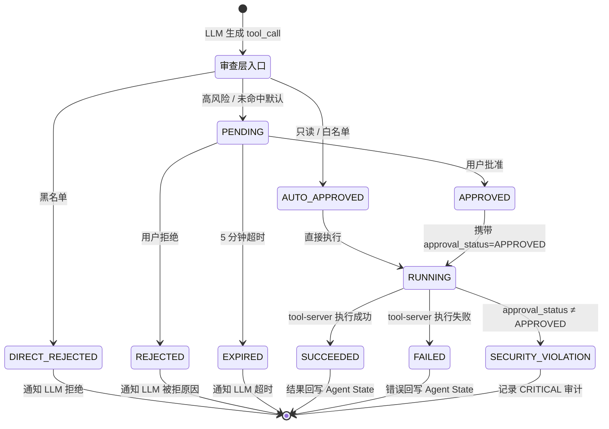

---

## Agent 循环：StateGraph + 编排器驱动

LangGraph StateGraph 管理节点拓扑。Graph 是纯函数（无 checkpointer、无 interrupt/resume），编排器（LoopOrchestrator）通过 `ainvoke()` 调用图并驱动审批循环。SSE 连接在审批等待期间保持存活，审批决策通过 REST 传入后由编排器合并到状态中并重新调用图。

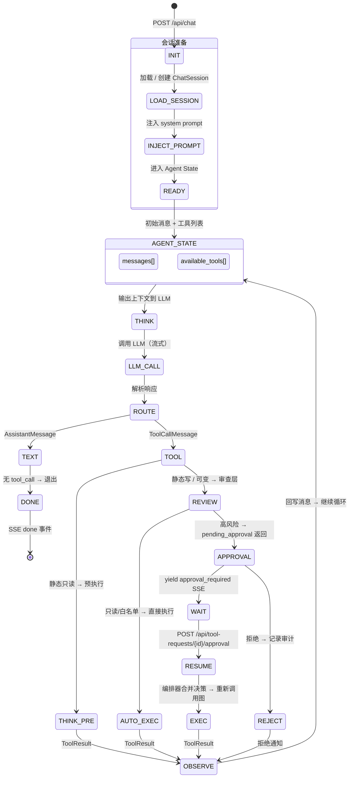

### 图拓扑（简图）

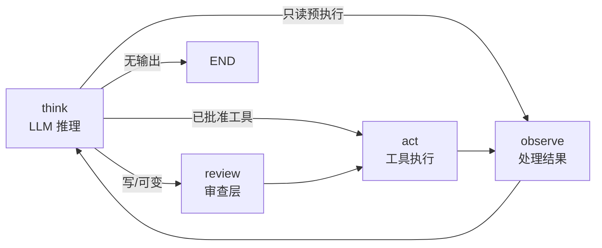

### 审批如何处理

Graph 是纯函数，不内部管理审批状态。`review_node` 返回 `pending_approval` 列表和 `Transition.APPROVAL_PENDING`，图执行结束。编排器（LoopOrchestrator）检测到 `pending_approval` 后：推送 `tool_approval_required` SSE 事件，通过 `ApprovalBridge` 等待用户决策，将决策合并到状态（`approved_tool_calls` / `rejected_tool_calls`），然后重新调用 `graph.ainvoke()`。`think_node` 检测到 `approved_tool_calls` 存在时走快速路径（跳过 LLM），直接路由到 `act_node` 执行。

### 循环状态

每个节点在返回值中附带 `transition` 字段，记录状态变更原因。编排器在每轮迭代结束时清理瞬态字段（`tool_calls`、`approved_tool_calls`、`pending_approval` 等）。

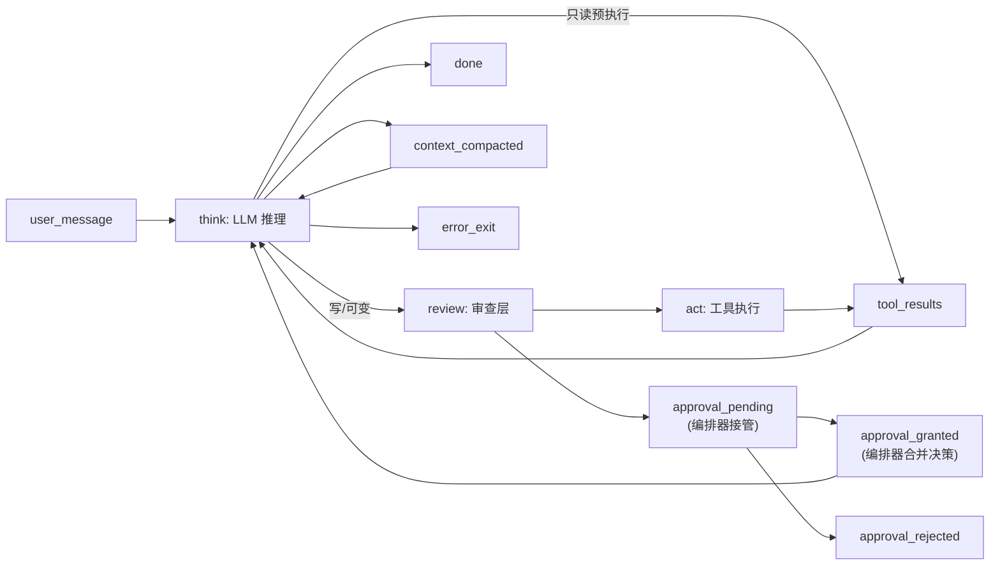

transition 值同时写入 `audit_events` 表（level=INFO），按 `chat_id` 可追溯完整循环轨迹。

---

## Agent State 内部结构

Agent State 是循环各阶段共享的上下文容器。每轮迭代从 State 读取消息和工具注册表，组装 prompt 输出到 LLM。

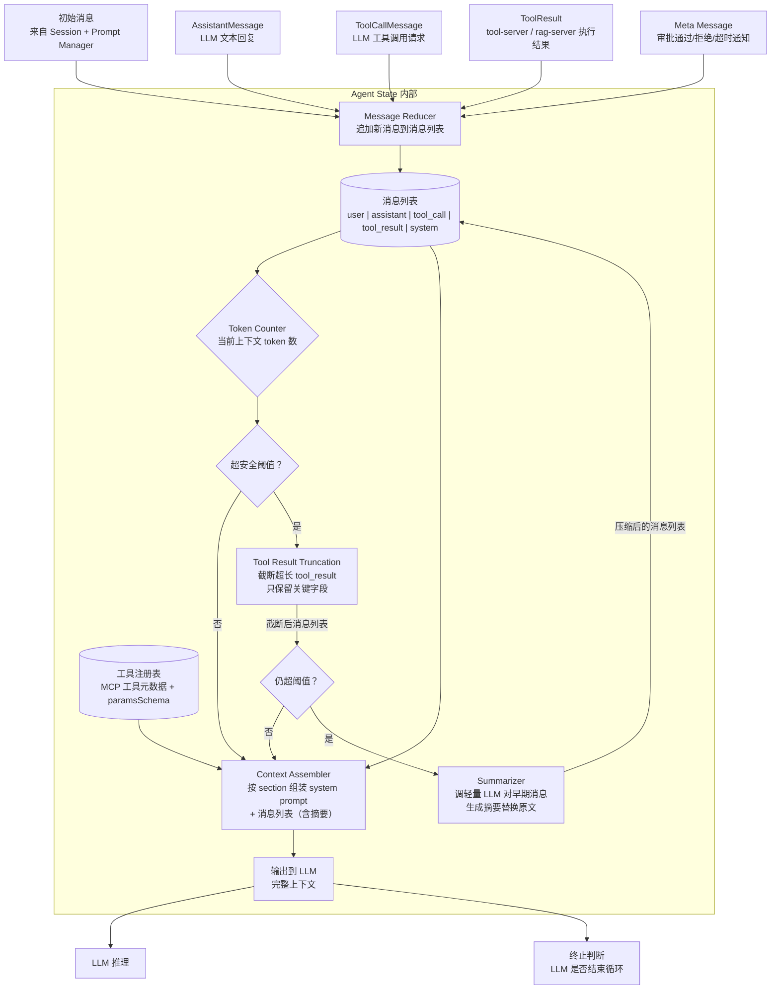

> **关键行为**：
> - **Message Reducer**：每次节点返回新消息时追加，不覆盖已有消息。
> - **Token Counter**：每轮 LLM 调用前以模型 tokenizer 计数。
> - **Tool Result Truncation**（第 1 层）：超阈值时先截断超长 tool_result，只保留摘要字段。开销几乎为零。
> - **Summarizer**（第 2 层）：截断后仍超阈值时，调轻量 LLM 对早期消息生成摘要；近期消息和工具结果优先保留原始内容。
> - **Context Assembler**：按 section 顺序（identity → rules → tool_usage → environment → memory）组装 system prompt，再拼接消息列表和可用工具定义，形成完整 prompt。Section 结构见 `doc/详细设计.md`。

---

## 并发 tool_call 处理

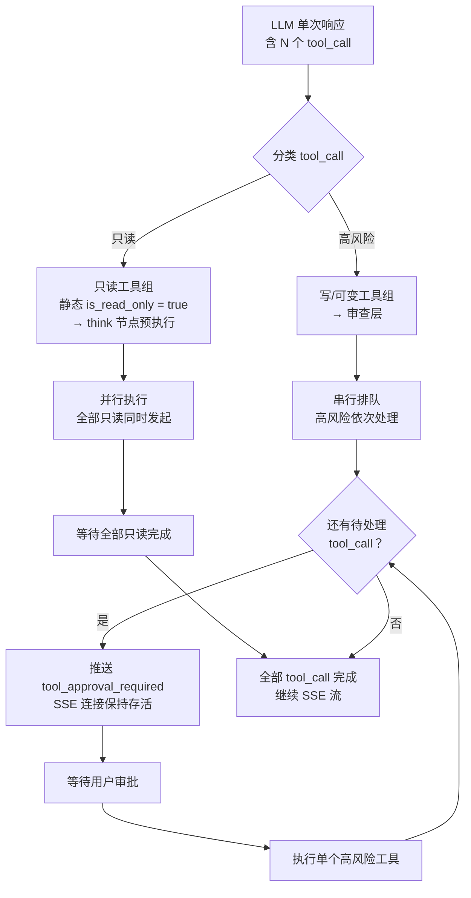

---

## 错误处理与恢复链

错误类型对应 `doc/详细设计.md` 定义的 8 种标准化分类。可恢复错误在流式输出阶段**留置**（不推送 SSE error 事件），进入恢复路径。恢复成功 → 继续流，用户无感知；恢复失败 → 才推送 `error` 事件。不可恢复类型直接表面错误。

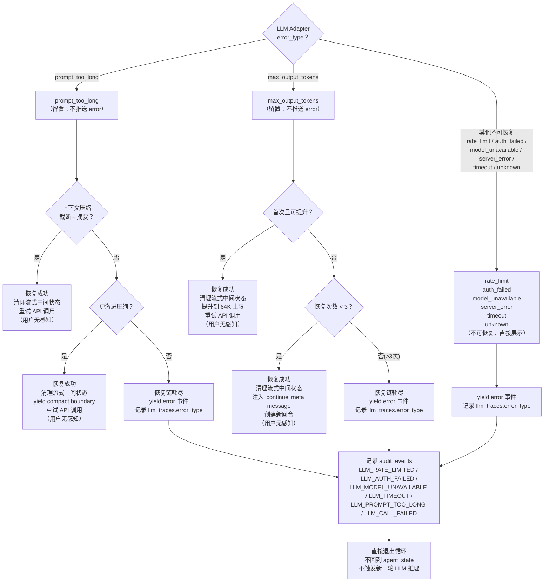

### 恢复策略

可恢复错误在流式阶段留置（不推送 SSE `error`），进入恢复链。不可恢复类型直接表面错误。每层恢复有 guard 变量防止重入——同一层不会因为重试后仍失败而再次触发同一策略。

| 错误类型 | 分类 | SSE 行为 | 第1层 | 第2层 | 第3层 | 防重入 guard |
|----------|------|----------|-------|-------|-------|-------------|
| prompt_too_long | 可恢复 | 留置，恢复成功则继续 | 上下文压缩（截断→摘要），重试 | 更激进的压缩策略，重试 | 终止并展示错误 | 第1层：`has_compacted_this_turn`；第2层：`has_attempted_aggressive_compact`；新一轮重置 |
| max_output_tokens | 可恢复 | 留置，恢复成功则继续 | 提升 token 上限透明重试 | 注入 "continue" 消息，最多 3 次 | 终止并展示错误 | 第1层：`max_tokens_escalated`；第2层：`output_token_recovery_count < 3` |
| rate_limit | 不可恢复 | 立即推送 error | 终止并展示错误 | — | — | — |
| model_unavailable | 不可恢复 | 立即推送 error | 终止并展示错误 | — | — | — |
| server_error | 不可恢复 | 立即推送 error | 终止并展示错误 | — | — | — |
| auth_failed | 不可恢复 | 立即推送 error | 终止并展示错误 | — | — | — |
| timeout | 不可恢复 | 立即推送 error | 终止并展示错误 | — | — | — |
| unknown | 不可恢复 | 立即推送 error | 终止并展示错误 | — | — | — |

### 重试前的状态清理

每次恢复重试 LLM 调用前，清理上一轮流式阶段累积的中间状态：
- **tombstone 上一轮的 assistant 消息**（向 UI 发送移除标记）
- 清空临时累加器（`assistant_messages`、`tool_results`、`tool_use_blocks`）
- 丢弃流式工具执行器的待处理任务，创建新实例

这避免了 orphaned tool_use/tool_result 序列污染重试请求，导致 API 报错。

### 死亡螺旋预防

以下三条规则防止"错误 → 重试 → 错误"的无限循环：

| 规则 | 说明 |
|------|------|
| 终止并展示错误后直接退出 | LLM 调用不可恢复错误或恢复链耗尽后，循环直接进入 `exit_loop`，不回到 `agent_state`。此时 LLM 未产出有效回复，继续推理无意义 |

---

## 会话生命周期

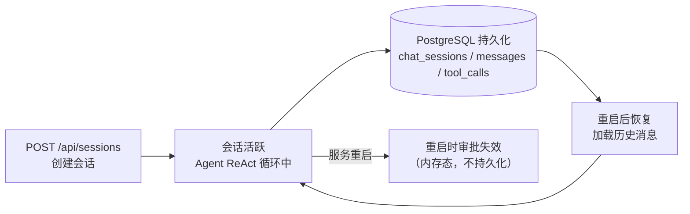

---

## 类图

展示组件静态结构：各层有哪些类、类之间的依赖和继承关系、每个类对外暴露的核心职责。

```mermaid
classDiagram
    %% ============================================================
    %% 外部框架/库
    %% ============================================================
    namespace external {
        class FastAPI_APIRouter {
            <<framework>>
        }
        class fastmcp_Client {
            <<library>>
        }
        class OpenAI_Client {
            <<library>>
        }
        class PostgreSQL {
            <<database>>
        }
    }

    %% ============================================================
    %% models — 数据模型，对应 doc/api-spec/openapi.yaml 的 schemas
    %% ============================================================
    namespace models {
        class Message {
            +messageID
            +chat_id
            +type: user|assistant|tool_call|tool_result|system
            +content
            +isMeta
        }
        class Tool {
            +name
            +server_name
            +description
            +mutable
            +is_read_only
            +is_rollbackable
        }
        class ToolCall {
            +chat_id
            +messageID
            +params
            +approval_status
            +execution_status
        }
        class ToolRequest {
            +request_id
            +approval_status: PENDING|APPROVED|REJECTED|EXPIRED
        }
        class ToolApproval {
            +approval_status: APPROVED|REJECTED
            +reason
        }
        class ToolResult {
            +execution_status: SUCCEEDED|FAILED
            +output
            +error
        }
        class ChatSession {
            +chat_id
            +messages[]
            +executed_tool_list[]
        }
        class AuditEvent {
            +level: INFO|WARN|ERROR|CRITICAL
            +event
            +actor
            +decision
        }
    }

    %% ============================================================
    %% agent — 编排层
    %% ============================================================
    namespace agent {
        class AgentState {
            +messages[]
            +available_tools[]
            +system
            +transition
        }
        class Query {
            +run(messages, tools, system) AsyncGenerator[SSEEvent]
            +resume(decisions) AsyncGenerator[SSEEvent]
        }
        class LoopOrchestrator {
            +run(initial_state) AsyncIterator
        }
    }

    %% ============================================================
    %% security — 审查层
    %% ============================================================
    namespace security {
        class RuleEngine {
            +evaluate(tool_name, is_read_only, is_rollbackable) str
        }
        class PendingApprovalBridge {
            +register(request_id, chat_id)
            +get_chat_id(request_id) str
            +remove(request_id)
        }
    }

    %% ============================================================
    %% mcp_client
    %% ============================================================
    namespace mcp_client {
        class ToolExecutor {
            +execute(tool_call) ToolResult
            +execute_parallel(tool_calls[]) ToolResult[]
            +list_tools() Tool[]
        }
    }

    %% ============================================================
    %% services
    %% ============================================================
    namespace services {
        class SessionManager {
            +create_session() ChatSession
            +get_session(chat_id) ChatSession
            +add_message(chat_id, msg)
        }
        class PromptManager {
            +load_sections() dict
            +build_system_prompt() str
        }
        class LLMAdapter {
            +generate(messages, tools) LLMResponse
            +generate_stream(messages, tools) AsyncIterator
        }
        class ContextManager {
            +count_tokens(messages) int
            +compress(messages) Message[]
        }
    }

    %% ============================================================
    %% observability
    %% ============================================================
    namespace observability {
        class AuditLogger {
            +log(event: AuditEvent)
        }
        class Tracer {
            +trace_llm_call(chat_id, model, usage, latency_ms)
        }
    }

    %% ============================================================
    %% api — FastAPI Router
    %% ============================================================
    namespace api {
        class ChatRouter
        class SessionRouter
        class ApprovalRouter
        class HealthRouter
    }

    %% ============================================================
    %% config
    %% ============================================================
    namespace config {
        class WebServerConfig
        class RulesConfig
        class LLMConfig
        class ServersConfig
    }

    %% ============================================================
    %% 关系：自定义 → 外部框架
    %% ============================================================
    ToolExecutor --> fastmcp_Client : wraps
    LLMAdapter --> OpenAI_Client : uses
    LLMAdapter --> PostgreSQL : traces to
    SessionManager --> PostgreSQL : uses

    %% ============================================================
    %% 关系：自定义内部
    %% ============================================================
    ToolCall --> ToolResult : produces

    ChatRouter --> Query : invokes
    SessionRouter --> SessionManager : invokes
    ApprovalRouter --> PendingApprovalBridge : uses

    Query --> LoopOrchestrator : creates
    LoopOrchestrator --> AgentState : drives
    AgentState --> ContextManager : uses
    AgentState "1" --> "*" Message : accumulates
    AgentState "1" --> "*" Tool : registers

    RuleEngine --> RulesConfig : reads
    PendingApprovalBridge --> AuditLogger : writes
    RuleEngine --> AuditLogger : writes

    SessionManager "1" --> "*" ChatSession : persists
    ChatSession "1" --> "*" Message : contains
    ChatSession "1" --> "*" ToolCall : contains
    PromptManager --> AgentState : injects

    WebServerConfig --> LLMAdapter : injects
    WebServerConfig --> RuleEngine : injects
    WebServerConfig --> AuditLogger : injects
    WebServerConfig --> Tracer : injects
```

---

## 数据流图

### 全系统数据流：用户输入到 SSE 响应

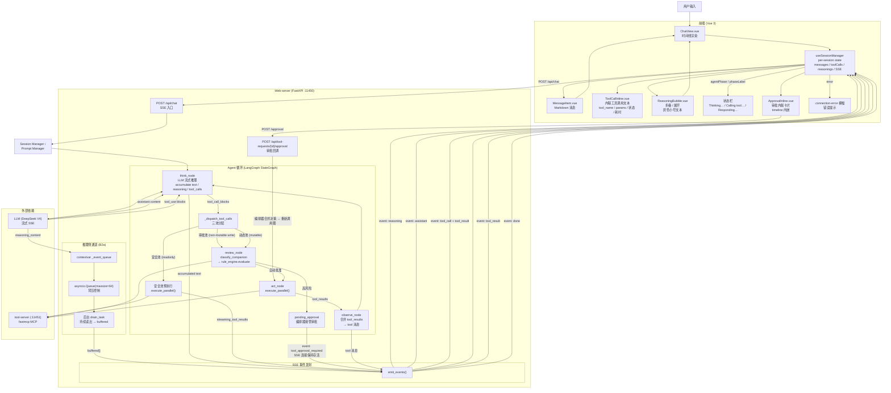

### 用户消息 → SSE 事件序列图

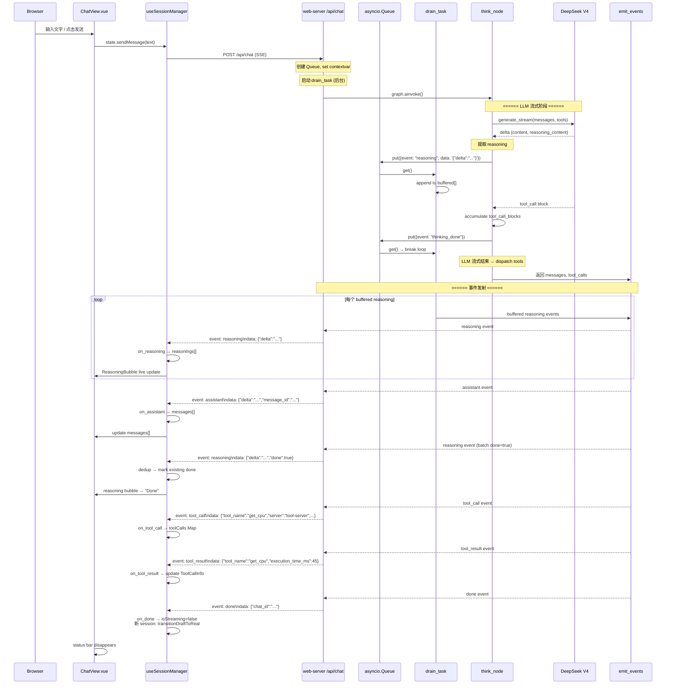

### 前端状态管理 & 时间线合并

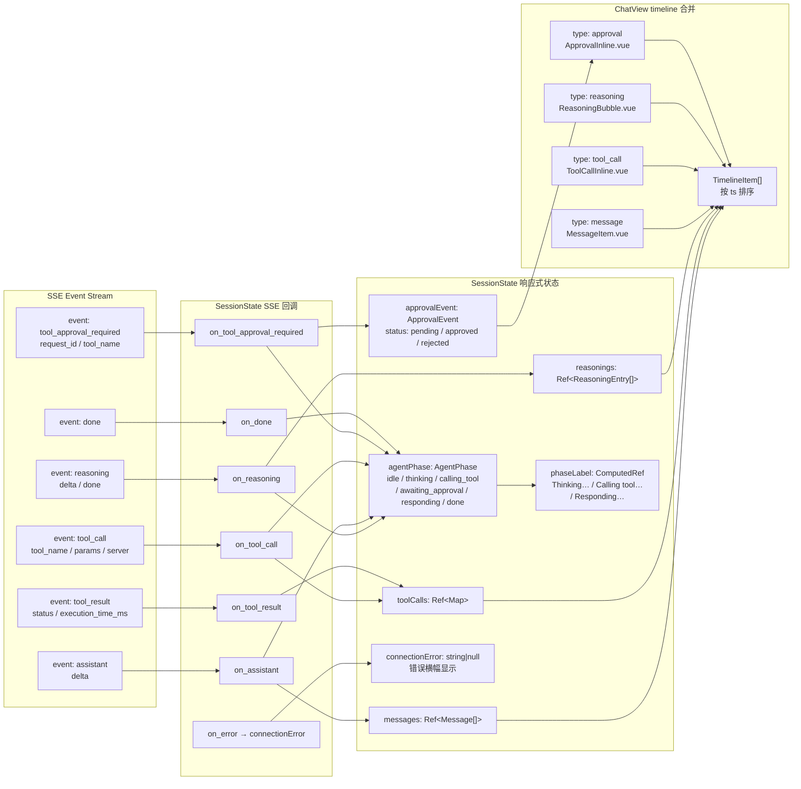

### 三池工具分配

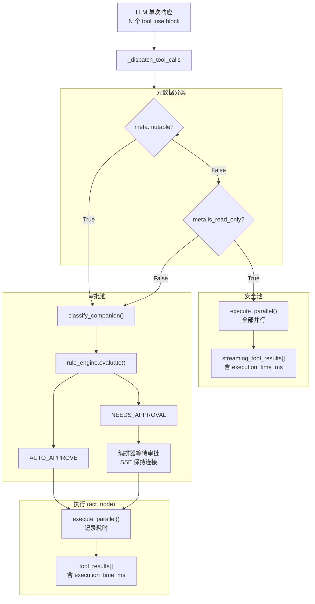
