# web-server 流程图

本文描述当前 `web-server/src/` 的实现结构。跨服务契约见 `docs/详细设计.md` 和 `docs/api-spec/openapi.yaml`。

## 总览：请求处理全链路

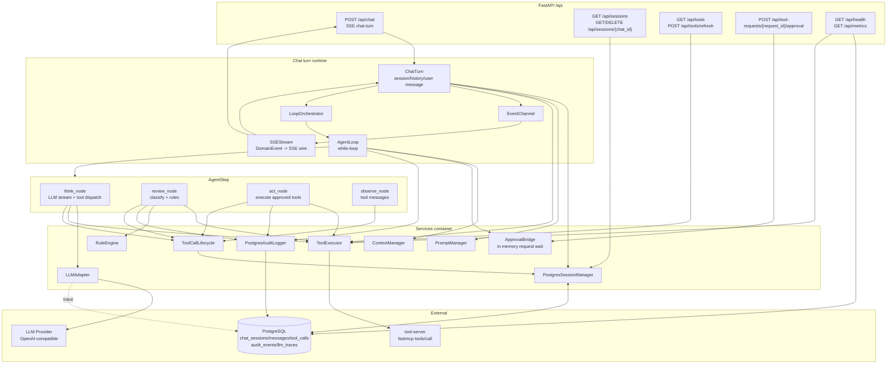

## API 入口

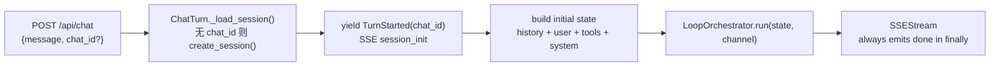

`POST /api/sessions` 当前不存在。会话由首条 `POST /api/chat` 自动创建；删除通过 `DELETE /api/sessions/{chat_id}` 软删除。

## SSE 事件映射

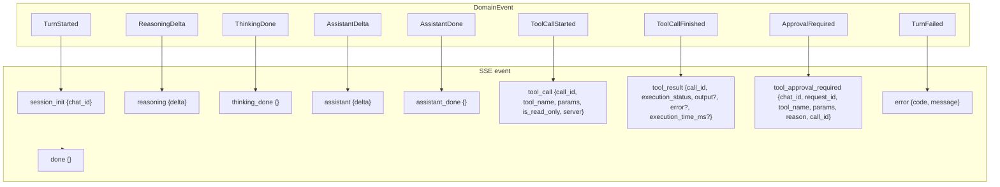

SSE 首事件为 `session_init`，不再使用 `X-Session-ID` header。`SSEStream.__aiter__()` 在 `finally` 中发送 `done`。

## AgentLoop：while-loop 编排

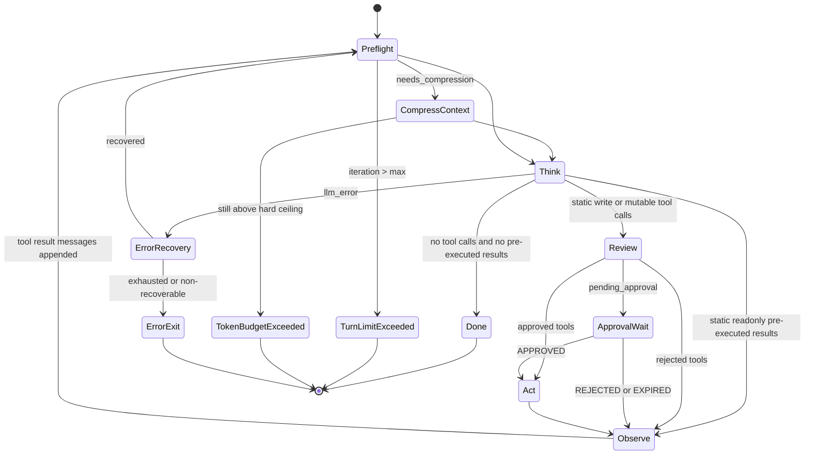

## AgentStep：think → review → act → observe

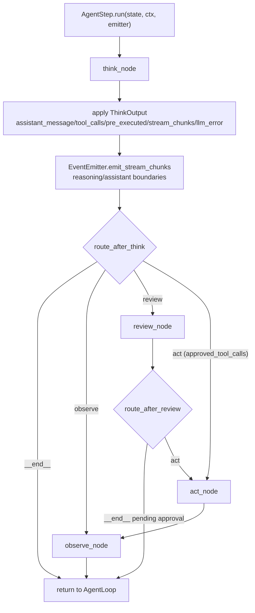

## 三池工具分配

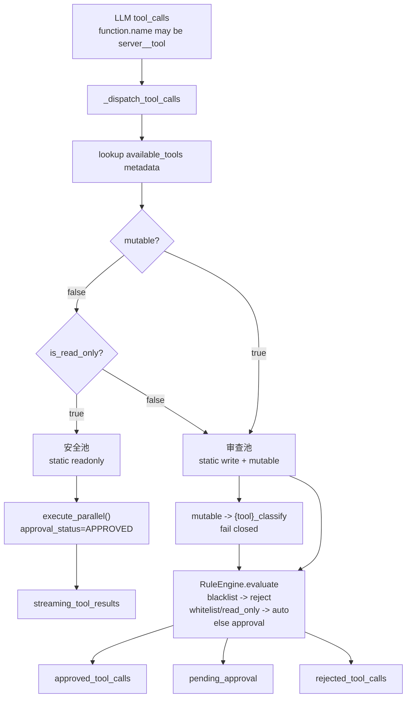

## 审批与执行状态机

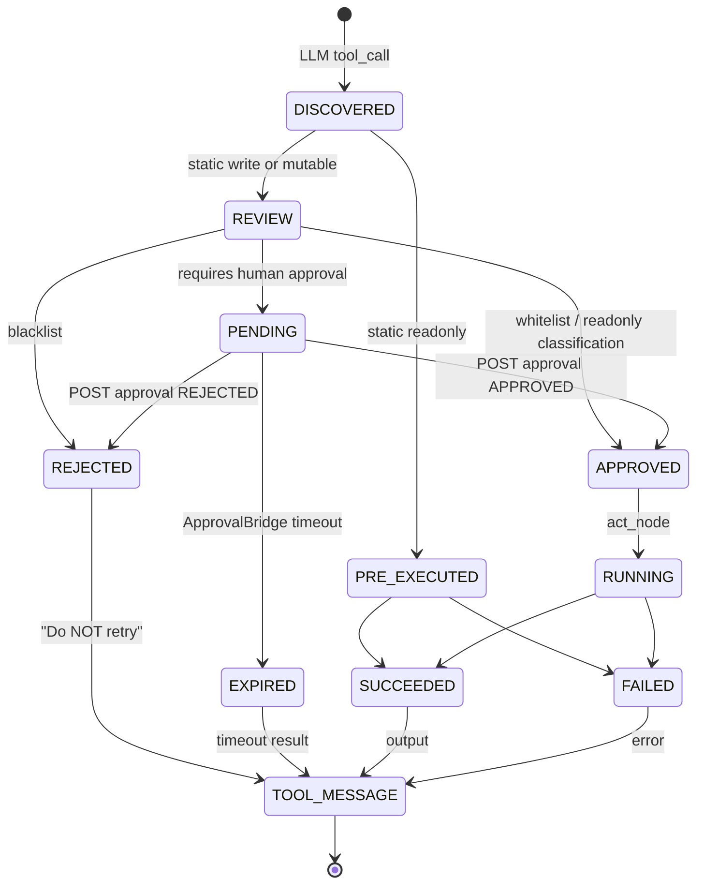

`SECURITY_VIOLATION` 是执行结果中的错误语义，不是 PostgreSQL `execution_status` enum。持久化时归为 `FAILED` 并记录 error。

## 审批恢复序列

```mermaid
sequenceDiagram
    participant F as Frontend
    participant API as /api/chat SSE
    participant Loop as AgentLoop
    participant AH as ApprovalHandler
    participant B as ApprovalBridge
    participant Approve as /api/tool-requests/{id}/approval
    participant Tool as tool-server

    Loop->>AH: resolve(pending_approval)
    AH->>B: create(request_id, chat_id)
    AH-->>API: ApprovalRequired DomainEvent
    API-->>F: event: tool_approval_required
    AH->>B: gather_decisions(request_id, timeout=300)
    F->>Approve: POST APPROVED / REJECTED
    Approve->>B: complete(request_id, status, reason)
    B-->>AH: decision
    alt approved
        AH->>Loop: approved_tool_calls
        Loop->>Tool: MCP tools/call with approval_status=APPROVED
        Tool-->>Loop: result
        Loop-->>API: tool_call + tool_result
    else rejected or expired
        AH->>Loop: rejected_tool_calls
        Loop-->>API: tool_result-like rejection message after observe
    end
```

## 持久化数据流

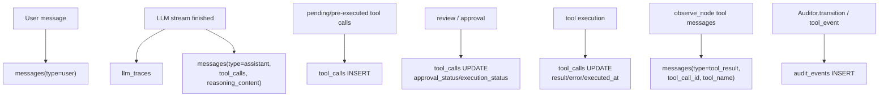

History reconstruction uses stored `messages` first. `tool_calls` remains the lifecycle ledger and compatibility fallback for older sessions.

## LLM 错误恢复

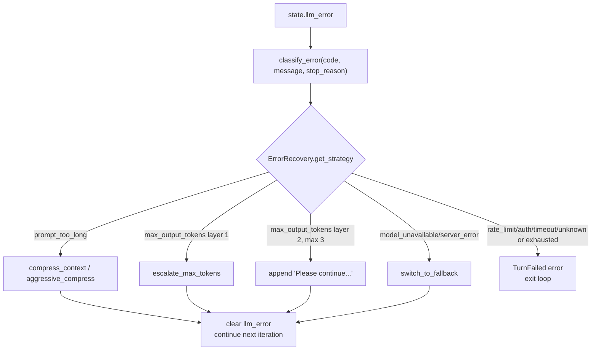

## 会话生命周期

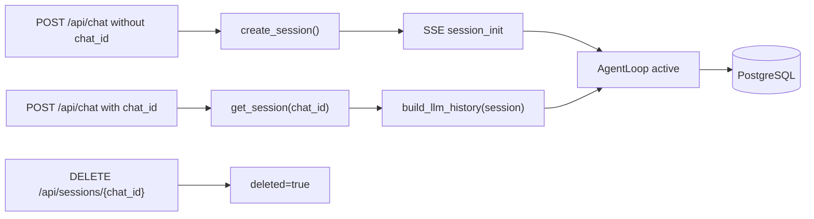

## 类图

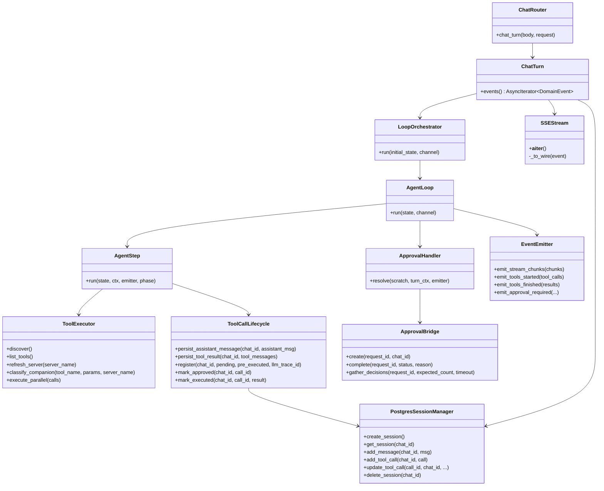

## API 数据流：用户消息到前端时间线

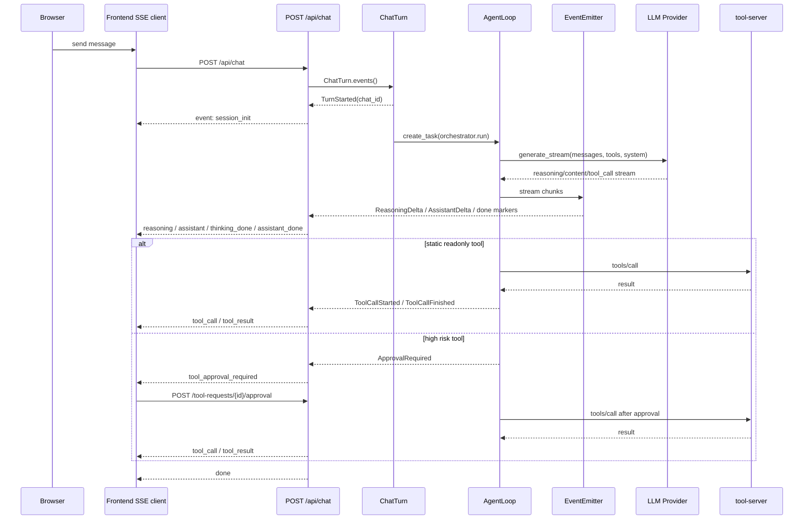
